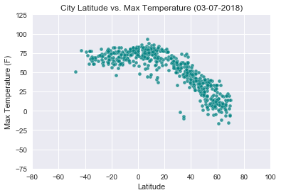
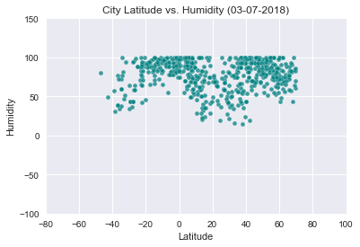
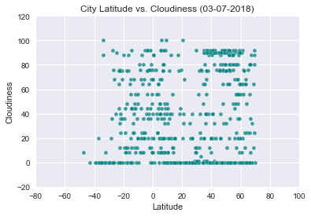
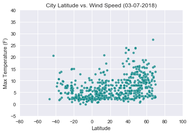

## Weather Analysis
- blah
- blah
- blah

```python
# Import Dependencies
import pandas as pd
import numpy as np

from citipy import citipy
import random
import json
import requests

import matplotlib.pyplot as plt
import seaborn as sns
sns.set(style="darkgrid")
import datetime

# openweathermap api key
from config import api_key
```

## Generate Cities List
```python
# Get random numbers for latitude and longitude
# Get numbers from size of 5000 to account for dropping duplicates and N/A cities on openweathermap
lat = np.random.randint(low=-90, high=90, size=(5000,))
lng = np.random.randint(low=-180, high=180, size=(5000,))

# Turn it into coordinates
coordinates = [lat,lng]
coordinates_sample = list(zip(*coordinates[::-1]))

# Plug in coordinates into citipy to get list of nearest cities
cities = []
for coordinate_pair in coordinates_sample:
    lati, lon = coordinate_pair
    cities.append(citipy.nearest_city(lati, lon))
    
# Get city name and country code and put in a list
country_code = []
city_name = []
for city in cities: 
    country_code.append(city.country_code)
    city_name.append(city.city_name)
```

## Make a Cities Weather Data Frame 
```python
# Make a summary dataframe for cities
cities_df = pd.DataFrame({"Country": country_code,
                          "City":city_name})

# Drop any duplicates
cities_df = cities_df.drop_duplicates(['City','Country'], keep=False)

# Add in empty columns with desired weather info
cities_df['Cloudiness'] = ''
cities_df['Date'] = ''
cities_df['Humidity'] = ''
cities_df['Lat'] = ''
cities_df['Lng'] = ''
cities_df['Max Temp'] = ''
cities_df['Wind Speed'] = ''
```

## Perform API Calls
```python
# Set parameters for query url 
params = {"appid": api_key, "units": "Imperial"}

# Set a variable for show of records
record = 1

# Print "Beginning of Data Retrieval"
print("Beginning of Data Retrieval")
print("----------------------------")

# Retrieve the data using pd.iterrows()
for index, row in cities_df.iterrows():
    url = "http://api.openweathermap.org/data/2.5/weather?"
    
    # Add in city parameter to parameters
    params['q'] = row['City']
    
    # Make url request from openweathermap api 
    weather_response = requests.get(url, params=params)
    print(f"Processing Record {record} | {row['City']}")
    print(weather_response.url)
    
    # Add one to record for next record
    record += 1
    
    # Make variable to hold response from api
    weather_json = weather_response.json()

    # Fill empty columns in cities_df with info from api. Use try/except for any N/A cities
    try:
        cities_df.set_value(index, "Max Temp", weather_json['main']['temp_max'])
        cities_df.set_value(index, "Country", weather_json['sys']['country'])
        cities_df.set_value(index, "Cloudiness", weather_json['clouds']['all'])
        cities_df.set_value(index, "Date", weather_json['dt'])
        cities_df.set_value(index, "Humidity", weather_json['main']['humidity'])
        cities_df.set_value(index, "Lat", weather_json['coord']['lat'])
        cities_df.set_value(index, "Lng", weather_json['coord']['lon'])
        cities_df.set_value(index, "Wind Speed", weather_json['wind']['speed'])
    except:
        cities_df.set_value(index, "City", np.nan)
        
# Print "Data Retrieval Complete"
print("----------------------------")
print("Data Retrieval Complete")
print("----------------------------")
```

    Beginning of Data Retrieval
    ----------------------------
    Processing Record 1 | dekoa
    http://api.openweathermap.org/data/2.5/weather?appid=d28b18768a2e31c92865084cffaea297&units=Imperial&q=dekoa
    Processing Record 2 | senanga
    http://api.openweathermap.org/data/2.5/weather?appid=d28b18768a2e31c92865084cffaea297&units=Imperial&q=senanga
    Processing Record 3 | malgrat de mar
    http://api.openweathermap.org/data/2.5/weather?appid=d28b18768a2e31c92865084cffaea297&units=Imperial&q=malgrat+de+mar
    Processing Record 4 | plettenberg bay
    http://api.openweathermap.org/data/2.5/weather?appid=d28b18768a2e31c92865084cffaea297&units=Imperial&q=plettenberg+bay
    Processing Record 5 | georgiyevka
    http://api.openweathermap.org/data/2.5/weather?appid=d28b18768a2e31c92865084cffaea297&units=Imperial&q=georgiyevka
    Processing Record 6 | neuruppin
    http://api.openweathermap.org/data/2.5/weather?appid=d28b18768a2e31c92865084cffaea297&units=Imperial&q=neuruppin
    Processing Record 7 | marrakesh
    http://api.openweathermap.org/data/2.5/weather?appid=d28b18768a2e31c92865084cffaea297&units=Imperial&q=marrakesh
    Processing Record 8 | leh
    http://api.openweathermap.org/data/2.5/weather?appid=d28b18768a2e31c92865084cffaea297&units=Imperial&q=leh
    Processing Record 9 | kota
    http://api.openweathermap.org/data/2.5/weather?appid=d28b18768a2e31c92865084cffaea297&units=Imperial&q=kota
    Processing Record 10 | ardahan
    http://api.openweathermap.org/data/2.5/weather?appid=d28b18768a2e31c92865084cffaea297&units=Imperial&q=ardahan
    Processing Record 11 | bosaso
    http://api.openweathermap.org/data/2.5/weather?appid=d28b18768a2e31c92865084cffaea297&units=Imperial&q=bosaso
    Processing Record 12 | sychevka
    http://api.openweathermap.org/data/2.5/weather?appid=d28b18768a2e31c92865084cffaea297&units=Imperial&q=sychevka
    Processing Record 13 | aleksandrov gay
    http://api.openweathermap.org/data/2.5/weather?appid=d28b18768a2e31c92865084cffaea297&units=Imperial&q=aleksandrov+gay
    Processing Record 14 | jorpeland
    http://api.openweathermap.org/data/2.5/weather?appid=d28b18768a2e31c92865084cffaea297&units=Imperial&q=jorpeland
    Processing Record 15 | westerland
    http://api.openweathermap.org/data/2.5/weather?appid=d28b18768a2e31c92865084cffaea297&units=Imperial&q=westerland
    Processing Record 16 | gedo
    http://api.openweathermap.org/data/2.5/weather?appid=d28b18768a2e31c92865084cffaea297&units=Imperial&q=gedo
    Processing Record 17 | skiros
    http://api.openweathermap.org/data/2.5/weather?appid=d28b18768a2e31c92865084cffaea297&units=Imperial&q=skiros
    Processing Record 18 | kanashevo
    http://api.openweathermap.org/data/2.5/weather?appid=d28b18768a2e31c92865084cffaea297&units=Imperial&q=kanashevo
    Processing Record 19 | alanya
    http://api.openweathermap.org/data/2.5/weather?appid=d28b18768a2e31c92865084cffaea297&units=Imperial&q=alanya
    Processing Record 20 | kalabo
    http://api.openweathermap.org/data/2.5/weather?appid=d28b18768a2e31c92865084cffaea297&units=Imperial&q=kalabo
    Processing Record 21 | peyima
    http://api.openweathermap.org/data/2.5/weather?appid=d28b18768a2e31c92865084cffaea297&units=Imperial&q=peyima
    Processing Record 22 | havre-saint-pierre
    http://api.openweathermap.org/data/2.5/weather?appid=d28b18768a2e31c92865084cffaea297&units=Imperial&q=havre-saint-pierre
    Processing Record 23 | miandrivazo
    http://api.openweathermap.org/data/2.5/weather?appid=d28b18768a2e31c92865084cffaea297&units=Imperial&q=miandrivazo
    Processing Record 24 | sertanopolis
    http://api.openweathermap.org/data/2.5/weather?appid=d28b18768a2e31c92865084cffaea297&units=Imperial&q=sertanopolis
    Processing Record 25 | solwezi
    http://api.openweathermap.org/data/2.5/weather?appid=d28b18768a2e31c92865084cffaea297&units=Imperial&q=solwezi
    Processing Record 26 | jiblah
    http://api.openweathermap.org/data/2.5/weather?appid=d28b18768a2e31c92865084cffaea297&units=Imperial&q=jiblah
    Processing Record 27 | puerto leguizamo
    http://api.openweathermap.org/data/2.5/weather?appid=d28b18768a2e31c92865084cffaea297&units=Imperial&q=puerto+leguizamo
    Processing Record 28 | isabela
    http://api.openweathermap.org/data/2.5/weather?appid=d28b18768a2e31c92865084cffaea297&units=Imperial&q=isabela
    Processing Record 29 | amboasary
    http://api.openweathermap.org/data/2.5/weather?appid=d28b18768a2e31c92865084cffaea297&units=Imperial&q=amboasary
    Processing Record 30 | itarema
    http://api.openweathermap.org/data/2.5/weather?appid=d28b18768a2e31c92865084cffaea297&units=Imperial&q=itarema
    Processing Record 31 | rodrigues alves
    http://api.openweathermap.org/data/2.5/weather?appid=d28b18768a2e31c92865084cffaea297&units=Imperial&q=rodrigues+alves
    Processing Record 32 | kutum
    http://api.openweathermap.org/data/2.5/weather?appid=d28b18768a2e31c92865084cffaea297&units=Imperial&q=kutum
    Processing Record 33 | jaisalmer
    http://api.openweathermap.org/data/2.5/weather?appid=d28b18768a2e31c92865084cffaea297&units=Imperial&q=jaisalmer
    Processing Record 34 | moroni
    http://api.openweathermap.org/data/2.5/weather?appid=d28b18768a2e31c92865084cffaea297&units=Imperial&q=moroni
    Processing Record 35 | merritt island
    http://api.openweathermap.org/data/2.5/weather?appid=d28b18768a2e31c92865084cffaea297&units=Imperial&q=merritt+island
    Processing Record 36 | cotonou
    http://api.openweathermap.org/data/2.5/weather?appid=d28b18768a2e31c92865084cffaea297&units=Imperial&q=cotonou
    Processing Record 37 | mahbubabad
    http://api.openweathermap.org/data/2.5/weather?appid=d28b18768a2e31c92865084cffaea297&units=Imperial&q=mahbubabad
    Processing Record 38 | yondo
    http://api.openweathermap.org/data/2.5/weather?appid=d28b18768a2e31c92865084cffaea297&units=Imperial&q=yondo
    Processing Record 39 | buraydah
    http://api.openweathermap.org/data/2.5/weather?appid=d28b18768a2e31c92865084cffaea297&units=Imperial&q=buraydah
    Processing Record 40 | chabahar
    http://api.openweathermap.org/data/2.5/weather?appid=d28b18768a2e31c92865084cffaea297&units=Imperial&q=chabahar
    Processing Record 41 | wote
    http://api.openweathermap.org/data/2.5/weather?appid=d28b18768a2e31c92865084cffaea297&units=Imperial&q=wote
    Processing Record 42 | kanker
    http://api.openweathermap.org/data/2.5/weather?appid=d28b18768a2e31c92865084cffaea297&units=Imperial&q=kanker
    Processing Record 43 | kifri
    http://api.openweathermap.org/data/2.5/weather?appid=d28b18768a2e31c92865084cffaea297&units=Imperial&q=kifri
    Processing Record 44 | winchester
    http://api.openweathermap.org/data/2.5/weather?appid=d28b18768a2e31c92865084cffaea297&units=Imperial&q=winchester
    Processing Record 45 | hauterive
    http://api.openweathermap.org/data/2.5/weather?appid=d28b18768a2e31c92865084cffaea297&units=Imperial&q=hauterive
    Processing Record 46 | medina del campo
    http://api.openweathermap.org/data/2.5/weather?appid=d28b18768a2e31c92865084cffaea297&units=Imperial&q=medina+del+campo
    Processing Record 47 | saltpond
    http://api.openweathermap.org/data/2.5/weather?appid=d28b18768a2e31c92865084cffaea297&units=Imperial&q=saltpond
    Processing Record 48 | mamou
    http://api.openweathermap.org/data/2.5/weather?appid=d28b18768a2e31c92865084cffaea297&units=Imperial&q=mamou
    Processing Record 49 | katiola
    http://api.openweathermap.org/data/2.5/weather?appid=d28b18768a2e31c92865084cffaea297&units=Imperial&q=katiola
    Processing Record 50 | tsentralnyy
    http://api.openweathermap.org/data/2.5/weather?appid=d28b18768a2e31c92865084cffaea297&units=Imperial&q=tsentralnyy
    Processing Record 51 | viramgam
    http://api.openweathermap.org/data/2.5/weather?appid=d28b18768a2e31c92865084cffaea297&units=Imperial&q=viramgam
    Processing Record 52 | usinsk
    http://api.openweathermap.org/data/2.5/weather?appid=d28b18768a2e31c92865084cffaea297&units=Imperial&q=usinsk
    Processing Record 53 | panaba
    http://api.openweathermap.org/data/2.5/weather?appid=d28b18768a2e31c92865084cffaea297&units=Imperial&q=panaba
    Processing Record 54 | saint-leu
    http://api.openweathermap.org/data/2.5/weather?appid=d28b18768a2e31c92865084cffaea297&units=Imperial&q=saint-leu
    Processing Record 55 | fasa
    http://api.openweathermap.org/data/2.5/weather?appid=d28b18768a2e31c92865084cffaea297&units=Imperial&q=fasa
    Processing Record 56 | nisia floresta
    http://api.openweathermap.org/data/2.5/weather?appid=d28b18768a2e31c92865084cffaea297&units=Imperial&q=nisia+floresta
    Processing Record 57 | faya
    http://api.openweathermap.org/data/2.5/weather?appid=d28b18768a2e31c92865084cffaea297&units=Imperial&q=faya
    Processing Record 58 | krasnyy bogatyr
    http://api.openweathermap.org/data/2.5/weather?appid=d28b18768a2e31c92865084cffaea297&units=Imperial&q=krasnyy+bogatyr
    Processing Record 59 | boa vista
    http://api.openweathermap.org/data/2.5/weather?appid=d28b18768a2e31c92865084cffaea297&units=Imperial&q=boa+vista
    Processing Record 60 | cheuskiny
    http://api.openweathermap.org/data/2.5/weather?appid=d28b18768a2e31c92865084cffaea297&units=Imperial&q=cheuskiny
    Processing Record 61 | certeju de sus
    http://api.openweathermap.org/data/2.5/weather?appid=d28b18768a2e31c92865084cffaea297&units=Imperial&q=certeju+de+sus
    Processing Record 62 | hwange
    http://api.openweathermap.org/data/2.5/weather?appid=d28b18768a2e31c92865084cffaea297&units=Imperial&q=hwange
    Processing Record 63 | maghama
    http://api.openweathermap.org/data/2.5/weather?appid=d28b18768a2e31c92865084cffaea297&units=Imperial&q=maghama
    Processing Record 64 | tromso
    http://api.openweathermap.org/data/2.5/weather?appid=d28b18768a2e31c92865084cffaea297&units=Imperial&q=tromso
    Processing Record 65 | araguacu
    http://api.openweathermap.org/data/2.5/weather?appid=d28b18768a2e31c92865084cffaea297&units=Imperial&q=araguacu
    Processing Record 66 | tulum
    http://api.openweathermap.org/data/2.5/weather?appid=d28b18768a2e31c92865084cffaea297&units=Imperial&q=tulum
    Processing Record 67 | grand-lahou
    http://api.openweathermap.org/data/2.5/weather?appid=d28b18768a2e31c92865084cffaea297&units=Imperial&q=grand-lahou
    Processing Record 68 | port-de-bouc
    http://api.openweathermap.org/data/2.5/weather?appid=d28b18768a2e31c92865084cffaea297&units=Imperial&q=port-de-bouc
    Processing Record 69 | mahon
    http://api.openweathermap.org/data/2.5/weather?appid=d28b18768a2e31c92865084cffaea297&units=Imperial&q=mahon
    Processing Record 70 | goya
    http://api.openweathermap.org/data/2.5/weather?appid=d28b18768a2e31c92865084cffaea297&units=Imperial&q=goya
    Processing Record 71 | tubruq
    http://api.openweathermap.org/data/2.5/weather?appid=d28b18768a2e31c92865084cffaea297&units=Imperial&q=tubruq
    Processing Record 72 | cefalu
    http://api.openweathermap.org/data/2.5/weather?appid=d28b18768a2e31c92865084cffaea297&units=Imperial&q=cefalu
    Processing Record 73 | hungund
    http://api.openweathermap.org/data/2.5/weather?appid=d28b18768a2e31c92865084cffaea297&units=Imperial&q=hungund
    Processing Record 74 | sarahan
    http://api.openweathermap.org/data/2.5/weather?appid=d28b18768a2e31c92865084cffaea297&units=Imperial&q=sarahan
    Processing Record 75 | novo aripuana
    http://api.openweathermap.org/data/2.5/weather?appid=d28b18768a2e31c92865084cffaea297&units=Imperial&q=novo+aripuana
    Processing Record 76 | umm kaddadah
    http://api.openweathermap.org/data/2.5/weather?appid=d28b18768a2e31c92865084cffaea297&units=Imperial&q=umm+kaddadah
    Processing Record 77 | morros
    http://api.openweathermap.org/data/2.5/weather?appid=d28b18768a2e31c92865084cffaea297&units=Imperial&q=morros
    Processing Record 78 | tortoli
    http://api.openweathermap.org/data/2.5/weather?appid=d28b18768a2e31c92865084cffaea297&units=Imperial&q=tortoli
    Processing Record 79 | krasnoarmeysk
    http://api.openweathermap.org/data/2.5/weather?appid=d28b18768a2e31c92865084cffaea297&units=Imperial&q=krasnoarmeysk
    Processing Record 80 | gerash
    http://api.openweathermap.org/data/2.5/weather?appid=d28b18768a2e31c92865084cffaea297&units=Imperial&q=gerash
    Processing Record 81 | ploemeur
    http://api.openweathermap.org/data/2.5/weather?appid=d28b18768a2e31c92865084cffaea297&units=Imperial&q=ploemeur
    Processing Record 82 | abong mbang
    http://api.openweathermap.org/data/2.5/weather?appid=d28b18768a2e31c92865084cffaea297&units=Imperial&q=abong+mbang
    Processing Record 83 | umzimvubu
    http://api.openweathermap.org/data/2.5/weather?appid=d28b18768a2e31c92865084cffaea297&units=Imperial&q=umzimvubu
    Processing Record 84 | puerto ayora
    http://api.openweathermap.org/data/2.5/weather?appid=d28b18768a2e31c92865084cffaea297&units=Imperial&q=puerto+ayora
    Processing Record 85 | viligili
    http://api.openweathermap.org/data/2.5/weather?appid=d28b18768a2e31c92865084cffaea297&units=Imperial&q=viligili
    Processing Record 86 | pozo colorado
    http://api.openweathermap.org/data/2.5/weather?appid=d28b18768a2e31c92865084cffaea297&units=Imperial&q=pozo+colorado
    Processing Record 87 | bajo baudo
    http://api.openweathermap.org/data/2.5/weather?appid=d28b18768a2e31c92865084cffaea297&units=Imperial&q=bajo+baudo
    Processing Record 88 | makurdi
    http://api.openweathermap.org/data/2.5/weather?appid=d28b18768a2e31c92865084cffaea297&units=Imperial&q=makurdi
    Processing Record 89 | balsas
    http://api.openweathermap.org/data/2.5/weather?appid=d28b18768a2e31c92865084cffaea297&units=Imperial&q=balsas
    Processing Record 90 | tiebissou
    http://api.openweathermap.org/data/2.5/weather?appid=d28b18768a2e31c92865084cffaea297&units=Imperial&q=tiebissou
    Processing Record 91 | sergiyevsk
    http://api.openweathermap.org/data/2.5/weather?appid=d28b18768a2e31c92865084cffaea297&units=Imperial&q=sergiyevsk
    Processing Record 92 | wattegama
    http://api.openweathermap.org/data/2.5/weather?appid=d28b18768a2e31c92865084cffaea297&units=Imperial&q=wattegama
    Processing Record 93 | luanda
    http://api.openweathermap.org/data/2.5/weather?appid=d28b18768a2e31c92865084cffaea297&units=Imperial&q=luanda
    Processing Record 94 | burgeo
    http://api.openweathermap.org/data/2.5/weather?appid=d28b18768a2e31c92865084cffaea297&units=Imperial&q=burgeo
    Processing Record 95 | marmaris
    http://api.openweathermap.org/data/2.5/weather?appid=d28b18768a2e31c92865084cffaea297&units=Imperial&q=marmaris
    Processing Record 96 | booue
    http://api.openweathermap.org/data/2.5/weather?appid=d28b18768a2e31c92865084cffaea297&units=Imperial&q=booue
    Processing Record 97 | lahijan
    http://api.openweathermap.org/data/2.5/weather?appid=d28b18768a2e31c92865084cffaea297&units=Imperial&q=lahijan
    Processing Record 98 | sandwick
    http://api.openweathermap.org/data/2.5/weather?appid=d28b18768a2e31c92865084cffaea297&units=Imperial&q=sandwick
    Processing Record 99 | aksu
    http://api.openweathermap.org/data/2.5/weather?appid=d28b18768a2e31c92865084cffaea297&units=Imperial&q=aksu
    Processing Record 100 | tonj
    http://api.openweathermap.org/data/2.5/weather?appid=d28b18768a2e31c92865084cffaea297&units=Imperial&q=tonj
    Processing Record 101 | maldonado
    http://api.openweathermap.org/data/2.5/weather?appid=d28b18768a2e31c92865084cffaea297&units=Imperial&q=maldonado
    Processing Record 102 | mbandaka
    http://api.openweathermap.org/data/2.5/weather?appid=d28b18768a2e31c92865084cffaea297&units=Imperial&q=mbandaka
    Processing Record 103 | moyale
    http://api.openweathermap.org/data/2.5/weather?appid=d28b18768a2e31c92865084cffaea297&units=Imperial&q=moyale
    Processing Record 104 | surgut
    http://api.openweathermap.org/data/2.5/weather?appid=d28b18768a2e31c92865084cffaea297&units=Imperial&q=surgut
    Processing Record 105 | matagami
    http://api.openweathermap.org/data/2.5/weather?appid=d28b18768a2e31c92865084cffaea297&units=Imperial&q=matagami
    Processing Record 106 | rosita
    http://api.openweathermap.org/data/2.5/weather?appid=d28b18768a2e31c92865084cffaea297&units=Imperial&q=rosita
    Processing Record 107 | dossor
    http://api.openweathermap.org/data/2.5/weather?appid=d28b18768a2e31c92865084cffaea297&units=Imperial&q=dossor
    Processing Record 108 | benjamin constant
    http://api.openweathermap.org/data/2.5/weather?appid=d28b18768a2e31c92865084cffaea297&units=Imperial&q=benjamin+constant
    Processing Record 109 | adzope
    http://api.openweathermap.org/data/2.5/weather?appid=d28b18768a2e31c92865084cffaea297&units=Imperial&q=adzope
    Processing Record 110 | libenge
    http://api.openweathermap.org/data/2.5/weather?appid=d28b18768a2e31c92865084cffaea297&units=Imperial&q=libenge
    Processing Record 111 | sao geraldo do araguaia
    http://api.openweathermap.org/data/2.5/weather?appid=d28b18768a2e31c92865084cffaea297&units=Imperial&q=sao+geraldo+do+araguaia
    Processing Record 112 | malindi
    http://api.openweathermap.org/data/2.5/weather?appid=d28b18768a2e31c92865084cffaea297&units=Imperial&q=malindi
    Processing Record 113 | sumbe
    http://api.openweathermap.org/data/2.5/weather?appid=d28b18768a2e31c92865084cffaea297&units=Imperial&q=sumbe
    Processing Record 114 | bowmore
    http://api.openweathermap.org/data/2.5/weather?appid=d28b18768a2e31c92865084cffaea297&units=Imperial&q=bowmore
    Processing Record 115 | varias
    http://api.openweathermap.org/data/2.5/weather?appid=d28b18768a2e31c92865084cffaea297&units=Imperial&q=varias
    Processing Record 116 | hare bay
    http://api.openweathermap.org/data/2.5/weather?appid=d28b18768a2e31c92865084cffaea297&units=Imperial&q=hare+bay
    Processing Record 117 | matamba
    http://api.openweathermap.org/data/2.5/weather?appid=d28b18768a2e31c92865084cffaea297&units=Imperial&q=matamba
    Processing Record 118 | matranovak
    http://api.openweathermap.org/data/2.5/weather?appid=d28b18768a2e31c92865084cffaea297&units=Imperial&q=matranovak
    Processing Record 119 | achit
    http://api.openweathermap.org/data/2.5/weather?appid=d28b18768a2e31c92865084cffaea297&units=Imperial&q=achit
    Processing Record 120 | caucaia
    http://api.openweathermap.org/data/2.5/weather?appid=d28b18768a2e31c92865084cffaea297&units=Imperial&q=caucaia
    Processing Record 121 | kontagora
    http://api.openweathermap.org/data/2.5/weather?appid=d28b18768a2e31c92865084cffaea297&units=Imperial&q=kontagora
    Processing Record 122 | riyadh
    http://api.openweathermap.org/data/2.5/weather?appid=d28b18768a2e31c92865084cffaea297&units=Imperial&q=riyadh
    Processing Record 123 | geresk
    http://api.openweathermap.org/data/2.5/weather?appid=d28b18768a2e31c92865084cffaea297&units=Imperial&q=geresk
    Processing Record 124 | oromocto
    http://api.openweathermap.org/data/2.5/weather?appid=d28b18768a2e31c92865084cffaea297&units=Imperial&q=oromocto
    Processing Record 125 | jimma
    http://api.openweathermap.org/data/2.5/weather?appid=d28b18768a2e31c92865084cffaea297&units=Imperial&q=jimma
    Processing Record 126 | cacequi
    http://api.openweathermap.org/data/2.5/weather?appid=d28b18768a2e31c92865084cffaea297&units=Imperial&q=cacequi
    Processing Record 127 | san ramon
    http://api.openweathermap.org/data/2.5/weather?appid=d28b18768a2e31c92865084cffaea297&units=Imperial&q=san+ramon
    Processing Record 128 | ceres
    http://api.openweathermap.org/data/2.5/weather?appid=d28b18768a2e31c92865084cffaea297&units=Imperial&q=ceres
    Processing Record 129 | aksarka
    http://api.openweathermap.org/data/2.5/weather?appid=d28b18768a2e31c92865084cffaea297&units=Imperial&q=aksarka
    Processing Record 130 | karauzyak
    http://api.openweathermap.org/data/2.5/weather?appid=d28b18768a2e31c92865084cffaea297&units=Imperial&q=karauzyak
    Processing Record 131 | porto de moz
    http://api.openweathermap.org/data/2.5/weather?appid=d28b18768a2e31c92865084cffaea297&units=Imperial&q=porto+de+moz
    Processing Record 132 | abapo
    http://api.openweathermap.org/data/2.5/weather?appid=d28b18768a2e31c92865084cffaea297&units=Imperial&q=abapo
    Processing Record 133 | santiago del estero
    http://api.openweathermap.org/data/2.5/weather?appid=d28b18768a2e31c92865084cffaea297&units=Imperial&q=santiago+del+estero
    Processing Record 134 | alappuzha
    http://api.openweathermap.org/data/2.5/weather?appid=d28b18768a2e31c92865084cffaea297&units=Imperial&q=alappuzha
    Processing Record 135 | ionia
    http://api.openweathermap.org/data/2.5/weather?appid=d28b18768a2e31c92865084cffaea297&units=Imperial&q=ionia
    Processing Record 136 | mehndawal
    http://api.openweathermap.org/data/2.5/weather?appid=d28b18768a2e31c92865084cffaea297&units=Imperial&q=mehndawal
    Processing Record 137 | reconquista
    http://api.openweathermap.org/data/2.5/weather?appid=d28b18768a2e31c92865084cffaea297&units=Imperial&q=reconquista
    Processing Record 138 | santa rosa
    http://api.openweathermap.org/data/2.5/weather?appid=d28b18768a2e31c92865084cffaea297&units=Imperial&q=santa+rosa
    Processing Record 139 | corning
    http://api.openweathermap.org/data/2.5/weather?appid=d28b18768a2e31c92865084cffaea297&units=Imperial&q=corning
    Processing Record 140 | mocuba
    http://api.openweathermap.org/data/2.5/weather?appid=d28b18768a2e31c92865084cffaea297&units=Imperial&q=mocuba
    Processing Record 141 | mantua
    http://api.openweathermap.org/data/2.5/weather?appid=d28b18768a2e31c92865084cffaea297&units=Imperial&q=mantua
    Processing Record 142 | jutai
    http://api.openweathermap.org/data/2.5/weather?appid=d28b18768a2e31c92865084cffaea297&units=Imperial&q=jutai
    Processing Record 143 | luau
    http://api.openweathermap.org/data/2.5/weather?appid=d28b18768a2e31c92865084cffaea297&units=Imperial&q=luau
    Processing Record 144 | lebrija
    http://api.openweathermap.org/data/2.5/weather?appid=d28b18768a2e31c92865084cffaea297&units=Imperial&q=lebrija
    Processing Record 145 | poirino
    http://api.openweathermap.org/data/2.5/weather?appid=d28b18768a2e31c92865084cffaea297&units=Imperial&q=poirino
    Processing Record 146 | gagnoa
    http://api.openweathermap.org/data/2.5/weather?appid=d28b18768a2e31c92865084cffaea297&units=Imperial&q=gagnoa
    Processing Record 147 | boke
    http://api.openweathermap.org/data/2.5/weather?appid=d28b18768a2e31c92865084cffaea297&units=Imperial&q=boke
    Processing Record 148 | punta alta
    http://api.openweathermap.org/data/2.5/weather?appid=d28b18768a2e31c92865084cffaea297&units=Imperial&q=punta+alta
    Processing Record 149 | pinsk
    http://api.openweathermap.org/data/2.5/weather?appid=d28b18768a2e31c92865084cffaea297&units=Imperial&q=pinsk
    Processing Record 150 | wahran
    http://api.openweathermap.org/data/2.5/weather?appid=d28b18768a2e31c92865084cffaea297&units=Imperial&q=wahran
    Processing Record 151 | mishkino
    http://api.openweathermap.org/data/2.5/weather?appid=d28b18768a2e31c92865084cffaea297&units=Imperial&q=mishkino
    Processing Record 152 | mizdah
    http://api.openweathermap.org/data/2.5/weather?appid=d28b18768a2e31c92865084cffaea297&units=Imperial&q=mizdah
    Processing Record 153 | cumaribo
    http://api.openweathermap.org/data/2.5/weather?appid=d28b18768a2e31c92865084cffaea297&units=Imperial&q=cumaribo
    Processing Record 154 | corinth
    http://api.openweathermap.org/data/2.5/weather?appid=d28b18768a2e31c92865084cffaea297&units=Imperial&q=corinth
    Processing Record 155 | dno
    http://api.openweathermap.org/data/2.5/weather?appid=d28b18768a2e31c92865084cffaea297&units=Imperial&q=dno
    Processing Record 156 | dvinskoy
    http://api.openweathermap.org/data/2.5/weather?appid=d28b18768a2e31c92865084cffaea297&units=Imperial&q=dvinskoy
    Processing Record 157 | bekhtery
    http://api.openweathermap.org/data/2.5/weather?appid=d28b18768a2e31c92865084cffaea297&units=Imperial&q=bekhtery
    Processing Record 158 | kirya
    http://api.openweathermap.org/data/2.5/weather?appid=d28b18768a2e31c92865084cffaea297&units=Imperial&q=kirya
    Processing Record 159 | stockach
    http://api.openweathermap.org/data/2.5/weather?appid=d28b18768a2e31c92865084cffaea297&units=Imperial&q=stockach
    Processing Record 160 | paracatu
    http://api.openweathermap.org/data/2.5/weather?appid=d28b18768a2e31c92865084cffaea297&units=Imperial&q=paracatu
    Processing Record 161 | banyo
    http://api.openweathermap.org/data/2.5/weather?appid=d28b18768a2e31c92865084cffaea297&units=Imperial&q=banyo
    Processing Record 162 | valparaiso
    http://api.openweathermap.org/data/2.5/weather?appid=d28b18768a2e31c92865084cffaea297&units=Imperial&q=valparaiso
    Processing Record 163 | male
    http://api.openweathermap.org/data/2.5/weather?appid=d28b18768a2e31c92865084cffaea297&units=Imperial&q=male
    Processing Record 164 | vryburg
    http://api.openweathermap.org/data/2.5/weather?appid=d28b18768a2e31c92865084cffaea297&units=Imperial&q=vryburg
    Processing Record 165 | kazerun
    http://api.openweathermap.org/data/2.5/weather?appid=d28b18768a2e31c92865084cffaea297&units=Imperial&q=kazerun
    Processing Record 166 | diego de almagro
    http://api.openweathermap.org/data/2.5/weather?appid=d28b18768a2e31c92865084cffaea297&units=Imperial&q=diego+de+almagro
    Processing Record 167 | awjilah
    http://api.openweathermap.org/data/2.5/weather?appid=d28b18768a2e31c92865084cffaea297&units=Imperial&q=awjilah
    Processing Record 168 | bengkulu
    http://api.openweathermap.org/data/2.5/weather?appid=d28b18768a2e31c92865084cffaea297&units=Imperial&q=bengkulu
    Processing Record 169 | sobinka
    http://api.openweathermap.org/data/2.5/weather?appid=d28b18768a2e31c92865084cffaea297&units=Imperial&q=sobinka
    Processing Record 170 | lomza
    http://api.openweathermap.org/data/2.5/weather?appid=d28b18768a2e31c92865084cffaea297&units=Imperial&q=lomza
    Processing Record 171 | juba
    http://api.openweathermap.org/data/2.5/weather?appid=d28b18768a2e31c92865084cffaea297&units=Imperial&q=juba
    Processing Record 172 | kurchum
    http://api.openweathermap.org/data/2.5/weather?appid=d28b18768a2e31c92865084cffaea297&units=Imperial&q=kurchum
    Processing Record 173 | catamarca
    http://api.openweathermap.org/data/2.5/weather?appid=d28b18768a2e31c92865084cffaea297&units=Imperial&q=catamarca
    Processing Record 174 | galle
    http://api.openweathermap.org/data/2.5/weather?appid=d28b18768a2e31c92865084cffaea297&units=Imperial&q=galle
    Processing Record 175 | jeremoabo
    http://api.openweathermap.org/data/2.5/weather?appid=d28b18768a2e31c92865084cffaea297&units=Imperial&q=jeremoabo
    Processing Record 176 | tres arroyos
    http://api.openweathermap.org/data/2.5/weather?appid=d28b18768a2e31c92865084cffaea297&units=Imperial&q=tres+arroyos
    Processing Record 177 | azimur
    http://api.openweathermap.org/data/2.5/weather?appid=d28b18768a2e31c92865084cffaea297&units=Imperial&q=azimur
    Processing Record 178 | marhaura
    http://api.openweathermap.org/data/2.5/weather?appid=d28b18768a2e31c92865084cffaea297&units=Imperial&q=marhaura
    Processing Record 179 | lindi
    http://api.openweathermap.org/data/2.5/weather?appid=d28b18768a2e31c92865084cffaea297&units=Imperial&q=lindi
    Processing Record 180 | springfield
    http://api.openweathermap.org/data/2.5/weather?appid=d28b18768a2e31c92865084cffaea297&units=Imperial&q=springfield
    Processing Record 181 | inndyr
    http://api.openweathermap.org/data/2.5/weather?appid=d28b18768a2e31c92865084cffaea297&units=Imperial&q=inndyr
    Processing Record 182 | oistins
    http://api.openweathermap.org/data/2.5/weather?appid=d28b18768a2e31c92865084cffaea297&units=Imperial&q=oistins
    Processing Record 183 | bela vista
    http://api.openweathermap.org/data/2.5/weather?appid=d28b18768a2e31c92865084cffaea297&units=Imperial&q=bela+vista
    Processing Record 184 | eydhafushi
    http://api.openweathermap.org/data/2.5/weather?appid=d28b18768a2e31c92865084cffaea297&units=Imperial&q=eydhafushi
    Processing Record 185 | karuzi
    http://api.openweathermap.org/data/2.5/weather?appid=d28b18768a2e31c92865084cffaea297&units=Imperial&q=karuzi
    Processing Record 186 | koutsouras
    http://api.openweathermap.org/data/2.5/weather?appid=d28b18768a2e31c92865084cffaea297&units=Imperial&q=koutsouras
    Processing Record 187 | lakeside
    http://api.openweathermap.org/data/2.5/weather?appid=d28b18768a2e31c92865084cffaea297&units=Imperial&q=lakeside
    Processing Record 188 | stokmarknes
    http://api.openweathermap.org/data/2.5/weather?appid=d28b18768a2e31c92865084cffaea297&units=Imperial&q=stokmarknes
    Processing Record 189 | sao miguel
    http://api.openweathermap.org/data/2.5/weather?appid=d28b18768a2e31c92865084cffaea297&units=Imperial&q=sao+miguel
    Processing Record 190 | yershov
    http://api.openweathermap.org/data/2.5/weather?appid=d28b18768a2e31c92865084cffaea297&units=Imperial&q=yershov
    Processing Record 191 | tabou
    http://api.openweathermap.org/data/2.5/weather?appid=d28b18768a2e31c92865084cffaea297&units=Imperial&q=tabou
    Processing Record 192 | muravlenko
    http://api.openweathermap.org/data/2.5/weather?appid=d28b18768a2e31c92865084cffaea297&units=Imperial&q=muravlenko
    Processing Record 193 | marsassoum
    http://api.openweathermap.org/data/2.5/weather?appid=d28b18768a2e31c92865084cffaea297&units=Imperial&q=marsassoum
    Processing Record 194 | turochak
    http://api.openweathermap.org/data/2.5/weather?appid=d28b18768a2e31c92865084cffaea297&units=Imperial&q=turochak
    Processing Record 195 | tourlaville
    http://api.openweathermap.org/data/2.5/weather?appid=d28b18768a2e31c92865084cffaea297&units=Imperial&q=tourlaville
    Processing Record 196 | balaka
    http://api.openweathermap.org/data/2.5/weather?appid=d28b18768a2e31c92865084cffaea297&units=Imperial&q=balaka
    Processing Record 197 | aquiraz
    http://api.openweathermap.org/data/2.5/weather?appid=d28b18768a2e31c92865084cffaea297&units=Imperial&q=aquiraz
    Processing Record 198 | kongolo
    http://api.openweathermap.org/data/2.5/weather?appid=d28b18768a2e31c92865084cffaea297&units=Imperial&q=kongolo
    Processing Record 199 | ouricuri
    http://api.openweathermap.org/data/2.5/weather?appid=d28b18768a2e31c92865084cffaea297&units=Imperial&q=ouricuri
    Processing Record 200 | tamandare
    http://api.openweathermap.org/data/2.5/weather?appid=d28b18768a2e31c92865084cffaea297&units=Imperial&q=tamandare
    Processing Record 201 | fourmies
    http://api.openweathermap.org/data/2.5/weather?appid=d28b18768a2e31c92865084cffaea297&units=Imperial&q=fourmies
    Processing Record 202 | damara
    http://api.openweathermap.org/data/2.5/weather?appid=d28b18768a2e31c92865084cffaea297&units=Imperial&q=damara
    Processing Record 203 | mosquera
    http://api.openweathermap.org/data/2.5/weather?appid=d28b18768a2e31c92865084cffaea297&units=Imperial&q=mosquera
    Processing Record 204 | celendin
    http://api.openweathermap.org/data/2.5/weather?appid=d28b18768a2e31c92865084cffaea297&units=Imperial&q=celendin
    Processing Record 205 | werda
    http://api.openweathermap.org/data/2.5/weather?appid=d28b18768a2e31c92865084cffaea297&units=Imperial&q=werda
    Processing Record 206 | mercedes
    http://api.openweathermap.org/data/2.5/weather?appid=d28b18768a2e31c92865084cffaea297&units=Imperial&q=mercedes
    Processing Record 207 | amambai
    http://api.openweathermap.org/data/2.5/weather?appid=d28b18768a2e31c92865084cffaea297&units=Imperial&q=amambai
    Processing Record 208 | atasu
    http://api.openweathermap.org/data/2.5/weather?appid=d28b18768a2e31c92865084cffaea297&units=Imperial&q=atasu
    Processing Record 209 | bachaquero
    http://api.openweathermap.org/data/2.5/weather?appid=d28b18768a2e31c92865084cffaea297&units=Imperial&q=bachaquero
    Processing Record 210 | oda
    http://api.openweathermap.org/data/2.5/weather?appid=d28b18768a2e31c92865084cffaea297&units=Imperial&q=oda
    Processing Record 211 | ustyuzhna
    http://api.openweathermap.org/data/2.5/weather?appid=d28b18768a2e31c92865084cffaea297&units=Imperial&q=ustyuzhna
    Processing Record 212 | vagur
    http://api.openweathermap.org/data/2.5/weather?appid=d28b18768a2e31c92865084cffaea297&units=Imperial&q=vagur
    Processing Record 213 | abalak
    http://api.openweathermap.org/data/2.5/weather?appid=d28b18768a2e31c92865084cffaea297&units=Imperial&q=abalak
    Processing Record 214 | foz
    http://api.openweathermap.org/data/2.5/weather?appid=d28b18768a2e31c92865084cffaea297&units=Imperial&q=foz
    Processing Record 215 | tazovskiy
    http://api.openweathermap.org/data/2.5/weather?appid=d28b18768a2e31c92865084cffaea297&units=Imperial&q=tazovskiy
    Processing Record 216 | keighley
    http://api.openweathermap.org/data/2.5/weather?appid=d28b18768a2e31c92865084cffaea297&units=Imperial&q=keighley
    Processing Record 217 | saint-raphael
    http://api.openweathermap.org/data/2.5/weather?appid=d28b18768a2e31c92865084cffaea297&units=Imperial&q=saint-raphael
    Processing Record 218 | lovozero
    http://api.openweathermap.org/data/2.5/weather?appid=d28b18768a2e31c92865084cffaea297&units=Imperial&q=lovozero
    Processing Record 219 | urengoy
    http://api.openweathermap.org/data/2.5/weather?appid=d28b18768a2e31c92865084cffaea297&units=Imperial&q=urengoy
    Processing Record 220 | neftcala
    http://api.openweathermap.org/data/2.5/weather?appid=d28b18768a2e31c92865084cffaea297&units=Imperial&q=neftcala
    Processing Record 221 | fuerte olimpo
    http://api.openweathermap.org/data/2.5/weather?appid=d28b18768a2e31c92865084cffaea297&units=Imperial&q=fuerte+olimpo
    Processing Record 222 | cumana
    http://api.openweathermap.org/data/2.5/weather?appid=d28b18768a2e31c92865084cffaea297&units=Imperial&q=cumana
    Processing Record 223 | sidi ali
    http://api.openweathermap.org/data/2.5/weather?appid=d28b18768a2e31c92865084cffaea297&units=Imperial&q=sidi+ali
    Processing Record 224 | malacacheta
    http://api.openweathermap.org/data/2.5/weather?appid=d28b18768a2e31c92865084cffaea297&units=Imperial&q=malacacheta
    Processing Record 225 | weligama
    http://api.openweathermap.org/data/2.5/weather?appid=d28b18768a2e31c92865084cffaea297&units=Imperial&q=weligama
    Processing Record 226 | hlotse
    http://api.openweathermap.org/data/2.5/weather?appid=d28b18768a2e31c92865084cffaea297&units=Imperial&q=hlotse
    Processing Record 227 | padang
    http://api.openweathermap.org/data/2.5/weather?appid=d28b18768a2e31c92865084cffaea297&units=Imperial&q=padang
    Processing Record 228 | auka
    http://api.openweathermap.org/data/2.5/weather?appid=d28b18768a2e31c92865084cffaea297&units=Imperial&q=auka
    Processing Record 229 | storsteinnes
    http://api.openweathermap.org/data/2.5/weather?appid=d28b18768a2e31c92865084cffaea297&units=Imperial&q=storsteinnes
    Processing Record 230 | diu
    http://api.openweathermap.org/data/2.5/weather?appid=d28b18768a2e31c92865084cffaea297&units=Imperial&q=diu
    Processing Record 231 | pafos
    http://api.openweathermap.org/data/2.5/weather?appid=d28b18768a2e31c92865084cffaea297&units=Imperial&q=pafos
    Processing Record 232 | bundibugyo
    http://api.openweathermap.org/data/2.5/weather?appid=d28b18768a2e31c92865084cffaea297&units=Imperial&q=bundibugyo
    Processing Record 233 | marica
    http://api.openweathermap.org/data/2.5/weather?appid=d28b18768a2e31c92865084cffaea297&units=Imperial&q=marica
    Processing Record 234 | bousso
    http://api.openweathermap.org/data/2.5/weather?appid=d28b18768a2e31c92865084cffaea297&units=Imperial&q=bousso
    Processing Record 235 | general pico
    http://api.openweathermap.org/data/2.5/weather?appid=d28b18768a2e31c92865084cffaea297&units=Imperial&q=general+pico
    Processing Record 236 | san francisco
    http://api.openweathermap.org/data/2.5/weather?appid=d28b18768a2e31c92865084cffaea297&units=Imperial&q=san+francisco
    Processing Record 237 | manicaragua
    http://api.openweathermap.org/data/2.5/weather?appid=d28b18768a2e31c92865084cffaea297&units=Imperial&q=manicaragua
    Processing Record 238 | kapiri mposhi
    http://api.openweathermap.org/data/2.5/weather?appid=d28b18768a2e31c92865084cffaea297&units=Imperial&q=kapiri+mposhi
    Processing Record 239 | puerto gaitan
    http://api.openweathermap.org/data/2.5/weather?appid=d28b18768a2e31c92865084cffaea297&units=Imperial&q=puerto+gaitan
    Processing Record 240 | beira
    http://api.openweathermap.org/data/2.5/weather?appid=d28b18768a2e31c92865084cffaea297&units=Imperial&q=beira
    Processing Record 241 | pervomayskoye
    http://api.openweathermap.org/data/2.5/weather?appid=d28b18768a2e31c92865084cffaea297&units=Imperial&q=pervomayskoye
    Processing Record 242 | salym
    http://api.openweathermap.org/data/2.5/weather?appid=d28b18768a2e31c92865084cffaea297&units=Imperial&q=salym
    Processing Record 243 | mokrousovo
    http://api.openweathermap.org/data/2.5/weather?appid=d28b18768a2e31c92865084cffaea297&units=Imperial&q=mokrousovo
    Processing Record 244 | karla
    http://api.openweathermap.org/data/2.5/weather?appid=d28b18768a2e31c92865084cffaea297&units=Imperial&q=karla
    Processing Record 245 | pangody
    http://api.openweathermap.org/data/2.5/weather?appid=d28b18768a2e31c92865084cffaea297&units=Imperial&q=pangody
    Processing Record 246 | doka
    http://api.openweathermap.org/data/2.5/weather?appid=d28b18768a2e31c92865084cffaea297&units=Imperial&q=doka
    Processing Record 247 | port-cartier
    http://api.openweathermap.org/data/2.5/weather?appid=d28b18768a2e31c92865084cffaea297&units=Imperial&q=port-cartier
    Processing Record 248 | oshnaviyeh
    http://api.openweathermap.org/data/2.5/weather?appid=d28b18768a2e31c92865084cffaea297&units=Imperial&q=oshnaviyeh
    Processing Record 249 | kitale
    http://api.openweathermap.org/data/2.5/weather?appid=d28b18768a2e31c92865084cffaea297&units=Imperial&q=kitale
    Processing Record 250 | lyubech
    http://api.openweathermap.org/data/2.5/weather?appid=d28b18768a2e31c92865084cffaea297&units=Imperial&q=lyubech
    Processing Record 251 | nador
    http://api.openweathermap.org/data/2.5/weather?appid=d28b18768a2e31c92865084cffaea297&units=Imperial&q=nador
    Processing Record 252 | agva
    http://api.openweathermap.org/data/2.5/weather?appid=d28b18768a2e31c92865084cffaea297&units=Imperial&q=agva
    Processing Record 253 | warqla
    http://api.openweathermap.org/data/2.5/weather?appid=d28b18768a2e31c92865084cffaea297&units=Imperial&q=warqla
    Processing Record 254 | tarko-sale
    http://api.openweathermap.org/data/2.5/weather?appid=d28b18768a2e31c92865084cffaea297&units=Imperial&q=tarko-sale
    Processing Record 255 | chapleau
    http://api.openweathermap.org/data/2.5/weather?appid=d28b18768a2e31c92865084cffaea297&units=Imperial&q=chapleau
    Processing Record 256 | oneonta
    http://api.openweathermap.org/data/2.5/weather?appid=d28b18768a2e31c92865084cffaea297&units=Imperial&q=oneonta
    Processing Record 257 | kursenai
    http://api.openweathermap.org/data/2.5/weather?appid=d28b18768a2e31c92865084cffaea297&units=Imperial&q=kursenai
    Processing Record 258 | kolondieba
    http://api.openweathermap.org/data/2.5/weather?appid=d28b18768a2e31c92865084cffaea297&units=Imperial&q=kolondieba
    Processing Record 259 | brindisi
    http://api.openweathermap.org/data/2.5/weather?appid=d28b18768a2e31c92865084cffaea297&units=Imperial&q=brindisi
    Processing Record 260 | geraldton
    http://api.openweathermap.org/data/2.5/weather?appid=d28b18768a2e31c92865084cffaea297&units=Imperial&q=geraldton
    Processing Record 261 | sirjan
    http://api.openweathermap.org/data/2.5/weather?appid=d28b18768a2e31c92865084cffaea297&units=Imperial&q=sirjan
    Processing Record 262 | san juan de colon
    http://api.openweathermap.org/data/2.5/weather?appid=d28b18768a2e31c92865084cffaea297&units=Imperial&q=san+juan+de+colon
    Processing Record 263 | birnin kebbi
    http://api.openweathermap.org/data/2.5/weather?appid=d28b18768a2e31c92865084cffaea297&units=Imperial&q=birnin+kebbi
    Processing Record 264 | rehoboth
    http://api.openweathermap.org/data/2.5/weather?appid=d28b18768a2e31c92865084cffaea297&units=Imperial&q=rehoboth
    Processing Record 265 | san antonio
    http://api.openweathermap.org/data/2.5/weather?appid=d28b18768a2e31c92865084cffaea297&units=Imperial&q=san+antonio
    Processing Record 266 | trincomalee
    http://api.openweathermap.org/data/2.5/weather?appid=d28b18768a2e31c92865084cffaea297&units=Imperial&q=trincomalee
    Processing Record 267 | torrington
    http://api.openweathermap.org/data/2.5/weather?appid=d28b18768a2e31c92865084cffaea297&units=Imperial&q=torrington
    Processing Record 268 | ihosy
    http://api.openweathermap.org/data/2.5/weather?appid=d28b18768a2e31c92865084cffaea297&units=Imperial&q=ihosy
    Processing Record 269 | ocean city
    http://api.openweathermap.org/data/2.5/weather?appid=d28b18768a2e31c92865084cffaea297&units=Imperial&q=ocean+city
    Processing Record 270 | culpeper
    http://api.openweathermap.org/data/2.5/weather?appid=d28b18768a2e31c92865084cffaea297&units=Imperial&q=culpeper
    Processing Record 271 | alta floresta
    http://api.openweathermap.org/data/2.5/weather?appid=d28b18768a2e31c92865084cffaea297&units=Imperial&q=alta+floresta
    Processing Record 272 | turtas
    http://api.openweathermap.org/data/2.5/weather?appid=d28b18768a2e31c92865084cffaea297&units=Imperial&q=turtas
    Processing Record 273 | graneros
    http://api.openweathermap.org/data/2.5/weather?appid=d28b18768a2e31c92865084cffaea297&units=Imperial&q=graneros
    Processing Record 274 | san andres
    http://api.openweathermap.org/data/2.5/weather?appid=d28b18768a2e31c92865084cffaea297&units=Imperial&q=san+andres
    Processing Record 275 | krasnovishersk
    http://api.openweathermap.org/data/2.5/weather?appid=d28b18768a2e31c92865084cffaea297&units=Imperial&q=krasnovishersk
    Processing Record 276 | puteyets
    http://api.openweathermap.org/data/2.5/weather?appid=d28b18768a2e31c92865084cffaea297&units=Imperial&q=puteyets
    Processing Record 277 | kompaniyivka
    http://api.openweathermap.org/data/2.5/weather?appid=d28b18768a2e31c92865084cffaea297&units=Imperial&q=kompaniyivka
    Processing Record 278 | camara de lobos
    http://api.openweathermap.org/data/2.5/weather?appid=d28b18768a2e31c92865084cffaea297&units=Imperial&q=camara+de+lobos
    Processing Record 279 | chililabombwe
    http://api.openweathermap.org/data/2.5/weather?appid=d28b18768a2e31c92865084cffaea297&units=Imperial&q=chililabombwe
    Processing Record 280 | newry
    http://api.openweathermap.org/data/2.5/weather?appid=d28b18768a2e31c92865084cffaea297&units=Imperial&q=newry
    Processing Record 281 | sao gabriel da cachoeira
    http://api.openweathermap.org/data/2.5/weather?appid=d28b18768a2e31c92865084cffaea297&units=Imperial&q=sao+gabriel+da+cachoeira
    Processing Record 282 | tubuala
    http://api.openweathermap.org/data/2.5/weather?appid=d28b18768a2e31c92865084cffaea297&units=Imperial&q=tubuala
    Processing Record 283 | velyka mykhaylivka
    http://api.openweathermap.org/data/2.5/weather?appid=d28b18768a2e31c92865084cffaea297&units=Imperial&q=velyka+mykhaylivka
    Processing Record 284 | termoli
    http://api.openweathermap.org/data/2.5/weather?appid=d28b18768a2e31c92865084cffaea297&units=Imperial&q=termoli
    Processing Record 285 | kipushi
    http://api.openweathermap.org/data/2.5/weather?appid=d28b18768a2e31c92865084cffaea297&units=Imperial&q=kipushi
    Processing Record 286 | doha
    http://api.openweathermap.org/data/2.5/weather?appid=d28b18768a2e31c92865084cffaea297&units=Imperial&q=doha
    Processing Record 287 | lenger
    http://api.openweathermap.org/data/2.5/weather?appid=d28b18768a2e31c92865084cffaea297&units=Imperial&q=lenger
    Processing Record 288 | vigrestad
    http://api.openweathermap.org/data/2.5/weather?appid=d28b18768a2e31c92865084cffaea297&units=Imperial&q=vigrestad
    Processing Record 289 | little current
    http://api.openweathermap.org/data/2.5/weather?appid=d28b18768a2e31c92865084cffaea297&units=Imperial&q=little+current
    Processing Record 290 | swellendam
    http://api.openweathermap.org/data/2.5/weather?appid=d28b18768a2e31c92865084cffaea297&units=Imperial&q=swellendam
    Processing Record 291 | lubango
    http://api.openweathermap.org/data/2.5/weather?appid=d28b18768a2e31c92865084cffaea297&units=Imperial&q=lubango
    Processing Record 292 | faridan
    http://api.openweathermap.org/data/2.5/weather?appid=d28b18768a2e31c92865084cffaea297&units=Imperial&q=faridan
    Processing Record 293 | ravne
    http://api.openweathermap.org/data/2.5/weather?appid=d28b18768a2e31c92865084cffaea297&units=Imperial&q=ravne
    Processing Record 294 | marv dasht
    http://api.openweathermap.org/data/2.5/weather?appid=d28b18768a2e31c92865084cffaea297&units=Imperial&q=marv+dasht
    Processing Record 295 | el alto
    http://api.openweathermap.org/data/2.5/weather?appid=d28b18768a2e31c92865084cffaea297&units=Imperial&q=el+alto
    Processing Record 296 | chiguayante
    http://api.openweathermap.org/data/2.5/weather?appid=d28b18768a2e31c92865084cffaea297&units=Imperial&q=chiguayante
    Processing Record 297 | chandur
    http://api.openweathermap.org/data/2.5/weather?appid=d28b18768a2e31c92865084cffaea297&units=Imperial&q=chandur
    Processing Record 298 | ust-ishim
    http://api.openweathermap.org/data/2.5/weather?appid=d28b18768a2e31c92865084cffaea297&units=Imperial&q=ust-ishim
    Processing Record 299 | carmo do rio claro
    http://api.openweathermap.org/data/2.5/weather?appid=d28b18768a2e31c92865084cffaea297&units=Imperial&q=carmo+do+rio+claro
    Processing Record 300 | sabathu
    http://api.openweathermap.org/data/2.5/weather?appid=d28b18768a2e31c92865084cffaea297&units=Imperial&q=sabathu
    Processing Record 301 | casablanca
    http://api.openweathermap.org/data/2.5/weather?appid=d28b18768a2e31c92865084cffaea297&units=Imperial&q=casablanca
    Processing Record 302 | hanko
    http://api.openweathermap.org/data/2.5/weather?appid=d28b18768a2e31c92865084cffaea297&units=Imperial&q=hanko
    Processing Record 303 | qaqortoq
    http://api.openweathermap.org/data/2.5/weather?appid=d28b18768a2e31c92865084cffaea297&units=Imperial&q=qaqortoq
    Processing Record 304 | nola
    http://api.openweathermap.org/data/2.5/weather?appid=d28b18768a2e31c92865084cffaea297&units=Imperial&q=nola
    Processing Record 305 | dunoon
    http://api.openweathermap.org/data/2.5/weather?appid=d28b18768a2e31c92865084cffaea297&units=Imperial&q=dunoon
    Processing Record 306 | loutros
    http://api.openweathermap.org/data/2.5/weather?appid=d28b18768a2e31c92865084cffaea297&units=Imperial&q=loutros
    Processing Record 307 | upington
    http://api.openweathermap.org/data/2.5/weather?appid=d28b18768a2e31c92865084cffaea297&units=Imperial&q=upington
    Processing Record 308 | camacupa
    http://api.openweathermap.org/data/2.5/weather?appid=d28b18768a2e31c92865084cffaea297&units=Imperial&q=camacupa
    Processing Record 309 | chachapoyas
    http://api.openweathermap.org/data/2.5/weather?appid=d28b18768a2e31c92865084cffaea297&units=Imperial&q=chachapoyas
    Processing Record 310 | santa rosa
    http://api.openweathermap.org/data/2.5/weather?appid=d28b18768a2e31c92865084cffaea297&units=Imperial&q=santa+rosa
    Processing Record 311 | dudinka
    http://api.openweathermap.org/data/2.5/weather?appid=d28b18768a2e31c92865084cffaea297&units=Imperial&q=dudinka
    Processing Record 312 | padrauna
    http://api.openweathermap.org/data/2.5/weather?appid=d28b18768a2e31c92865084cffaea297&units=Imperial&q=padrauna
    Processing Record 313 | sarai naurang
    http://api.openweathermap.org/data/2.5/weather?appid=d28b18768a2e31c92865084cffaea297&units=Imperial&q=sarai+naurang
    Processing Record 314 | solovetskiy
    http://api.openweathermap.org/data/2.5/weather?appid=d28b18768a2e31c92865084cffaea297&units=Imperial&q=solovetskiy
    Processing Record 315 | formoso do araguaia
    http://api.openweathermap.org/data/2.5/weather?appid=d28b18768a2e31c92865084cffaea297&units=Imperial&q=formoso+do+araguaia
    Processing Record 316 | kumluca
    http://api.openweathermap.org/data/2.5/weather?appid=d28b18768a2e31c92865084cffaea297&units=Imperial&q=kumluca
    Processing Record 317 | agirish
    http://api.openweathermap.org/data/2.5/weather?appid=d28b18768a2e31c92865084cffaea297&units=Imperial&q=agirish
    Processing Record 318 | voskevan
    http://api.openweathermap.org/data/2.5/weather?appid=d28b18768a2e31c92865084cffaea297&units=Imperial&q=voskevan
    Processing Record 319 | nioro
    http://api.openweathermap.org/data/2.5/weather?appid=d28b18768a2e31c92865084cffaea297&units=Imperial&q=nioro
    Processing Record 320 | oros
    http://api.openweathermap.org/data/2.5/weather?appid=d28b18768a2e31c92865084cffaea297&units=Imperial&q=oros
    Processing Record 321 | jeremie
    http://api.openweathermap.org/data/2.5/weather?appid=d28b18768a2e31c92865084cffaea297&units=Imperial&q=jeremie
    Processing Record 322 | dalbandin
    http://api.openweathermap.org/data/2.5/weather?appid=d28b18768a2e31c92865084cffaea297&units=Imperial&q=dalbandin
    Processing Record 323 | matam
    http://api.openweathermap.org/data/2.5/weather?appid=d28b18768a2e31c92865084cffaea297&units=Imperial&q=matam
    Processing Record 324 | lichtenburg
    http://api.openweathermap.org/data/2.5/weather?appid=d28b18768a2e31c92865084cffaea297&units=Imperial&q=lichtenburg
    Processing Record 325 | mala
    http://api.openweathermap.org/data/2.5/weather?appid=d28b18768a2e31c92865084cffaea297&units=Imperial&q=mala
    Processing Record 326 | garowe
    http://api.openweathermap.org/data/2.5/weather?appid=d28b18768a2e31c92865084cffaea297&units=Imperial&q=garowe
    Processing Record 327 | garissa
    http://api.openweathermap.org/data/2.5/weather?appid=d28b18768a2e31c92865084cffaea297&units=Imperial&q=garissa
    Processing Record 328 | dubovskoye
    http://api.openweathermap.org/data/2.5/weather?appid=d28b18768a2e31c92865084cffaea297&units=Imperial&q=dubovskoye
    Processing Record 329 | munster
    http://api.openweathermap.org/data/2.5/weather?appid=d28b18768a2e31c92865084cffaea297&units=Imperial&q=munster
    Processing Record 330 | slantsy
    http://api.openweathermap.org/data/2.5/weather?appid=d28b18768a2e31c92865084cffaea297&units=Imperial&q=slantsy
    Processing Record 331 | norton shores
    http://api.openweathermap.org/data/2.5/weather?appid=d28b18768a2e31c92865084cffaea297&units=Imperial&q=norton+shores
    Processing Record 332 | loubomo
    http://api.openweathermap.org/data/2.5/weather?appid=d28b18768a2e31c92865084cffaea297&units=Imperial&q=loubomo
    Processing Record 333 | diffa
    http://api.openweathermap.org/data/2.5/weather?appid=d28b18768a2e31c92865084cffaea297&units=Imperial&q=diffa
    Processing Record 334 | carutapera
    http://api.openweathermap.org/data/2.5/weather?appid=d28b18768a2e31c92865084cffaea297&units=Imperial&q=carutapera
    Processing Record 335 | karamay
    http://api.openweathermap.org/data/2.5/weather?appid=d28b18768a2e31c92865084cffaea297&units=Imperial&q=karamay
    Processing Record 336 | sokoni
    http://api.openweathermap.org/data/2.5/weather?appid=d28b18768a2e31c92865084cffaea297&units=Imperial&q=sokoni
    Processing Record 337 | ugoofaaru
    http://api.openweathermap.org/data/2.5/weather?appid=d28b18768a2e31c92865084cffaea297&units=Imperial&q=ugoofaaru
    Processing Record 338 | abu samrah
    http://api.openweathermap.org/data/2.5/weather?appid=d28b18768a2e31c92865084cffaea297&units=Imperial&q=abu+samrah
    Processing Record 339 | york
    http://api.openweathermap.org/data/2.5/weather?appid=d28b18768a2e31c92865084cffaea297&units=Imperial&q=york
    Processing Record 340 | hof
    http://api.openweathermap.org/data/2.5/weather?appid=d28b18768a2e31c92865084cffaea297&units=Imperial&q=hof
    Processing Record 341 | isla mujeres
    http://api.openweathermap.org/data/2.5/weather?appid=d28b18768a2e31c92865084cffaea297&units=Imperial&q=isla+mujeres
    Processing Record 342 | huarmey
    http://api.openweathermap.org/data/2.5/weather?appid=d28b18768a2e31c92865084cffaea297&units=Imperial&q=huarmey
    Processing Record 343 | lichinga
    http://api.openweathermap.org/data/2.5/weather?appid=d28b18768a2e31c92865084cffaea297&units=Imperial&q=lichinga
    Processing Record 344 | snasa
    http://api.openweathermap.org/data/2.5/weather?appid=d28b18768a2e31c92865084cffaea297&units=Imperial&q=snasa
    Processing Record 345 | thinadhoo
    http://api.openweathermap.org/data/2.5/weather?appid=d28b18768a2e31c92865084cffaea297&units=Imperial&q=thinadhoo
    Processing Record 346 | troitsko-pechorsk
    http://api.openweathermap.org/data/2.5/weather?appid=d28b18768a2e31c92865084cffaea297&units=Imperial&q=troitsko-pechorsk
    Processing Record 347 | conceicao da barra
    http://api.openweathermap.org/data/2.5/weather?appid=d28b18768a2e31c92865084cffaea297&units=Imperial&q=conceicao+da+barra
    Processing Record 348 | acarau
    http://api.openweathermap.org/data/2.5/weather?appid=d28b18768a2e31c92865084cffaea297&units=Imperial&q=acarau
    Processing Record 349 | pushkinskiye gory
    http://api.openweathermap.org/data/2.5/weather?appid=d28b18768a2e31c92865084cffaea297&units=Imperial&q=pushkinskiye+gory
    Processing Record 350 | salvador
    http://api.openweathermap.org/data/2.5/weather?appid=d28b18768a2e31c92865084cffaea297&units=Imperial&q=salvador
    Processing Record 351 | achim
    http://api.openweathermap.org/data/2.5/weather?appid=d28b18768a2e31c92865084cffaea297&units=Imperial&q=achim
    Processing Record 352 | campoverde
    http://api.openweathermap.org/data/2.5/weather?appid=d28b18768a2e31c92865084cffaea297&units=Imperial&q=campoverde
    Processing Record 353 | manoel urbano
    http://api.openweathermap.org/data/2.5/weather?appid=d28b18768a2e31c92865084cffaea297&units=Imperial&q=manoel+urbano
    Processing Record 354 | kuche
    http://api.openweathermap.org/data/2.5/weather?appid=d28b18768a2e31c92865084cffaea297&units=Imperial&q=kuche
    Processing Record 355 | atlantic city
    http://api.openweathermap.org/data/2.5/weather?appid=d28b18768a2e31c92865084cffaea297&units=Imperial&q=atlantic+city
    Processing Record 356 | novoagansk
    http://api.openweathermap.org/data/2.5/weather?appid=d28b18768a2e31c92865084cffaea297&units=Imperial&q=novoagansk
    Processing Record 357 | medvezhyegorsk
    http://api.openweathermap.org/data/2.5/weather?appid=d28b18768a2e31c92865084cffaea297&units=Imperial&q=medvezhyegorsk
    Processing Record 358 | pauini
    http://api.openweathermap.org/data/2.5/weather?appid=d28b18768a2e31c92865084cffaea297&units=Imperial&q=pauini
    Processing Record 359 | januaria
    http://api.openweathermap.org/data/2.5/weather?appid=d28b18768a2e31c92865084cffaea297&units=Imperial&q=januaria
    Processing Record 360 | delta del tigre
    http://api.openweathermap.org/data/2.5/weather?appid=d28b18768a2e31c92865084cffaea297&units=Imperial&q=delta+del+tigre
    Processing Record 361 | komsomolskiy
    http://api.openweathermap.org/data/2.5/weather?appid=d28b18768a2e31c92865084cffaea297&units=Imperial&q=komsomolskiy
    Processing Record 362 | strezhevoy
    http://api.openweathermap.org/data/2.5/weather?appid=d28b18768a2e31c92865084cffaea297&units=Imperial&q=strezhevoy
    Processing Record 363 | loukhi
    http://api.openweathermap.org/data/2.5/weather?appid=d28b18768a2e31c92865084cffaea297&units=Imperial&q=loukhi
    Processing Record 364 | barbar
    http://api.openweathermap.org/data/2.5/weather?appid=d28b18768a2e31c92865084cffaea297&units=Imperial&q=barbar
    Processing Record 365 | bealanana
    http://api.openweathermap.org/data/2.5/weather?appid=d28b18768a2e31c92865084cffaea297&units=Imperial&q=bealanana
    Processing Record 366 | pailon
    http://api.openweathermap.org/data/2.5/weather?appid=d28b18768a2e31c92865084cffaea297&units=Imperial&q=pailon
    Processing Record 367 | zelenoborsk
    http://api.openweathermap.org/data/2.5/weather?appid=d28b18768a2e31c92865084cffaea297&units=Imperial&q=zelenoborsk
    Processing Record 368 | marsabit
    http://api.openweathermap.org/data/2.5/weather?appid=d28b18768a2e31c92865084cffaea297&units=Imperial&q=marsabit
    Processing Record 369 | phalombe
    http://api.openweathermap.org/data/2.5/weather?appid=d28b18768a2e31c92865084cffaea297&units=Imperial&q=phalombe
    Processing Record 370 | paamiut
    http://api.openweathermap.org/data/2.5/weather?appid=d28b18768a2e31c92865084cffaea297&units=Imperial&q=paamiut
    Processing Record 371 | malur
    http://api.openweathermap.org/data/2.5/weather?appid=d28b18768a2e31c92865084cffaea297&units=Imperial&q=malur
    Processing Record 372 | barranca
    http://api.openweathermap.org/data/2.5/weather?appid=d28b18768a2e31c92865084cffaea297&units=Imperial&q=barranca
    Processing Record 373 | paducah
    http://api.openweathermap.org/data/2.5/weather?appid=d28b18768a2e31c92865084cffaea297&units=Imperial&q=paducah
    Processing Record 374 | yertsevo
    http://api.openweathermap.org/data/2.5/weather?appid=d28b18768a2e31c92865084cffaea297&units=Imperial&q=yertsevo
    Processing Record 375 | les cayes
    http://api.openweathermap.org/data/2.5/weather?appid=d28b18768a2e31c92865084cffaea297&units=Imperial&q=les+cayes
    Processing Record 376 | tibiri
    http://api.openweathermap.org/data/2.5/weather?appid=d28b18768a2e31c92865084cffaea297&units=Imperial&q=tibiri
    Processing Record 377 | zarya
    http://api.openweathermap.org/data/2.5/weather?appid=d28b18768a2e31c92865084cffaea297&units=Imperial&q=zarya
    Processing Record 378 | korla
    http://api.openweathermap.org/data/2.5/weather?appid=d28b18768a2e31c92865084cffaea297&units=Imperial&q=korla
    Processing Record 379 | menongue
    http://api.openweathermap.org/data/2.5/weather?appid=d28b18768a2e31c92865084cffaea297&units=Imperial&q=menongue
    Processing Record 380 | okitipupa
    http://api.openweathermap.org/data/2.5/weather?appid=d28b18768a2e31c92865084cffaea297&units=Imperial&q=okitipupa
    Processing Record 381 | samana
    http://api.openweathermap.org/data/2.5/weather?appid=d28b18768a2e31c92865084cffaea297&units=Imperial&q=samana
    Processing Record 382 | kaoma
    http://api.openweathermap.org/data/2.5/weather?appid=d28b18768a2e31c92865084cffaea297&units=Imperial&q=kaoma
    Processing Record 383 | pervouralsk
    http://api.openweathermap.org/data/2.5/weather?appid=d28b18768a2e31c92865084cffaea297&units=Imperial&q=pervouralsk
    Processing Record 384 | herat
    http://api.openweathermap.org/data/2.5/weather?appid=d28b18768a2e31c92865084cffaea297&units=Imperial&q=herat
    Processing Record 385 | kobojango
    http://api.openweathermap.org/data/2.5/weather?appid=d28b18768a2e31c92865084cffaea297&units=Imperial&q=kobojango
    Processing Record 386 | masalli
    http://api.openweathermap.org/data/2.5/weather?appid=d28b18768a2e31c92865084cffaea297&units=Imperial&q=masalli
    Processing Record 387 | buriti alegre
    http://api.openweathermap.org/data/2.5/weather?appid=d28b18768a2e31c92865084cffaea297&units=Imperial&q=buriti+alegre
    Processing Record 388 | lima duarte
    http://api.openweathermap.org/data/2.5/weather?appid=d28b18768a2e31c92865084cffaea297&units=Imperial&q=lima+duarte
    Processing Record 389 | tabulbah
    http://api.openweathermap.org/data/2.5/weather?appid=d28b18768a2e31c92865084cffaea297&units=Imperial&q=tabulbah
    Processing Record 390 | cenade
    http://api.openweathermap.org/data/2.5/weather?appid=d28b18768a2e31c92865084cffaea297&units=Imperial&q=cenade
    Processing Record 391 | murgab
    http://api.openweathermap.org/data/2.5/weather?appid=d28b18768a2e31c92865084cffaea297&units=Imperial&q=murgab
    Processing Record 392 | waynesboro
    http://api.openweathermap.org/data/2.5/weather?appid=d28b18768a2e31c92865084cffaea297&units=Imperial&q=waynesboro
    Processing Record 393 | amasya
    http://api.openweathermap.org/data/2.5/weather?appid=d28b18768a2e31c92865084cffaea297&units=Imperial&q=amasya
    Processing Record 394 | kerouane
    http://api.openweathermap.org/data/2.5/weather?appid=d28b18768a2e31c92865084cffaea297&units=Imperial&q=kerouane
    Processing Record 395 | chivilcoy
    http://api.openweathermap.org/data/2.5/weather?appid=d28b18768a2e31c92865084cffaea297&units=Imperial&q=chivilcoy
    Processing Record 396 | chicama
    http://api.openweathermap.org/data/2.5/weather?appid=d28b18768a2e31c92865084cffaea297&units=Imperial&q=chicama
    Processing Record 397 | toliary
    http://api.openweathermap.org/data/2.5/weather?appid=d28b18768a2e31c92865084cffaea297&units=Imperial&q=toliary
    Processing Record 398 | dolores
    http://api.openweathermap.org/data/2.5/weather?appid=d28b18768a2e31c92865084cffaea297&units=Imperial&q=dolores
    Processing Record 399 | tsumeb
    http://api.openweathermap.org/data/2.5/weather?appid=d28b18768a2e31c92865084cffaea297&units=Imperial&q=tsumeb
    Processing Record 400 | koulamoutou
    http://api.openweathermap.org/data/2.5/weather?appid=d28b18768a2e31c92865084cffaea297&units=Imperial&q=koulamoutou
    Processing Record 401 | ratisbon
    http://api.openweathermap.org/data/2.5/weather?appid=d28b18768a2e31c92865084cffaea297&units=Imperial&q=ratisbon
    Processing Record 402 | kazalinsk
    http://api.openweathermap.org/data/2.5/weather?appid=d28b18768a2e31c92865084cffaea297&units=Imperial&q=kazalinsk
    Processing Record 403 | dire
    http://api.openweathermap.org/data/2.5/weather?appid=d28b18768a2e31c92865084cffaea297&units=Imperial&q=dire
    Processing Record 404 | kayerkan
    http://api.openweathermap.org/data/2.5/weather?appid=d28b18768a2e31c92865084cffaea297&units=Imperial&q=kayerkan
    Processing Record 405 | bilma
    http://api.openweathermap.org/data/2.5/weather?appid=d28b18768a2e31c92865084cffaea297&units=Imperial&q=bilma
    Processing Record 406 | novaya malykla
    http://api.openweathermap.org/data/2.5/weather?appid=d28b18768a2e31c92865084cffaea297&units=Imperial&q=novaya+malykla
    Processing Record 407 | prainha
    http://api.openweathermap.org/data/2.5/weather?appid=d28b18768a2e31c92865084cffaea297&units=Imperial&q=prainha
    Processing Record 408 | balykshi
    http://api.openweathermap.org/data/2.5/weather?appid=d28b18768a2e31c92865084cffaea297&units=Imperial&q=balykshi
    Processing Record 409 | cienfuegos
    http://api.openweathermap.org/data/2.5/weather?appid=d28b18768a2e31c92865084cffaea297&units=Imperial&q=cienfuegos
    Processing Record 410 | santa isabel do rio negro
    http://api.openweathermap.org/data/2.5/weather?appid=d28b18768a2e31c92865084cffaea297&units=Imperial&q=santa+isabel+do+rio+negro
    Processing Record 411 | bereda
    http://api.openweathermap.org/data/2.5/weather?appid=d28b18768a2e31c92865084cffaea297&units=Imperial&q=bereda
    Processing Record 412 | kargasok
    http://api.openweathermap.org/data/2.5/weather?appid=d28b18768a2e31c92865084cffaea297&units=Imperial&q=kargasok
    Processing Record 413 | goba
    http://api.openweathermap.org/data/2.5/weather?appid=d28b18768a2e31c92865084cffaea297&units=Imperial&q=goba
    Processing Record 414 | gualaco
    http://api.openweathermap.org/data/2.5/weather?appid=d28b18768a2e31c92865084cffaea297&units=Imperial&q=gualaco
    Processing Record 415 | severnyy-kospashskiy
    http://api.openweathermap.org/data/2.5/weather?appid=d28b18768a2e31c92865084cffaea297&units=Imperial&q=severnyy-kospashskiy
    Processing Record 416 | ballina
    http://api.openweathermap.org/data/2.5/weather?appid=d28b18768a2e31c92865084cffaea297&units=Imperial&q=ballina
    Processing Record 417 | vera cruz
    http://api.openweathermap.org/data/2.5/weather?appid=d28b18768a2e31c92865084cffaea297&units=Imperial&q=vera+cruz
    Processing Record 418 | bara
    http://api.openweathermap.org/data/2.5/weather?appid=d28b18768a2e31c92865084cffaea297&units=Imperial&q=bara
    Processing Record 419 | gobabis
    http://api.openweathermap.org/data/2.5/weather?appid=d28b18768a2e31c92865084cffaea297&units=Imperial&q=gobabis
    Processing Record 420 | tivaouane
    http://api.openweathermap.org/data/2.5/weather?appid=d28b18768a2e31c92865084cffaea297&units=Imperial&q=tivaouane
    Processing Record 421 | charyshskoye
    http://api.openweathermap.org/data/2.5/weather?appid=d28b18768a2e31c92865084cffaea297&units=Imperial&q=charyshskoye
    Processing Record 422 | santander
    http://api.openweathermap.org/data/2.5/weather?appid=d28b18768a2e31c92865084cffaea297&units=Imperial&q=santander
    Processing Record 423 | bolshiye klyuchishchi
    http://api.openweathermap.org/data/2.5/weather?appid=d28b18768a2e31c92865084cffaea297&units=Imperial&q=bolshiye+klyuchishchi
    Processing Record 424 | high rock
    http://api.openweathermap.org/data/2.5/weather?appid=d28b18768a2e31c92865084cffaea297&units=Imperial&q=high+rock
    Processing Record 425 | lidkoping
    http://api.openweathermap.org/data/2.5/weather?appid=d28b18768a2e31c92865084cffaea297&units=Imperial&q=lidkoping
    Processing Record 426 | lisakovsk
    http://api.openweathermap.org/data/2.5/weather?appid=d28b18768a2e31c92865084cffaea297&units=Imperial&q=lisakovsk
    Processing Record 427 | middleton
    http://api.openweathermap.org/data/2.5/weather?appid=d28b18768a2e31c92865084cffaea297&units=Imperial&q=middleton
    Processing Record 428 | gravdal
    http://api.openweathermap.org/data/2.5/weather?appid=d28b18768a2e31c92865084cffaea297&units=Imperial&q=gravdal
    Processing Record 429 | nakskov
    http://api.openweathermap.org/data/2.5/weather?appid=d28b18768a2e31c92865084cffaea297&units=Imperial&q=nakskov
    Processing Record 430 | chingirlau
    http://api.openweathermap.org/data/2.5/weather?appid=d28b18768a2e31c92865084cffaea297&units=Imperial&q=chingirlau
    Processing Record 431 | wilmington
    http://api.openweathermap.org/data/2.5/weather?appid=d28b18768a2e31c92865084cffaea297&units=Imperial&q=wilmington
    Processing Record 432 | kushmurun
    http://api.openweathermap.org/data/2.5/weather?appid=d28b18768a2e31c92865084cffaea297&units=Imperial&q=kushmurun
    Processing Record 433 | melo
    http://api.openweathermap.org/data/2.5/weather?appid=d28b18768a2e31c92865084cffaea297&units=Imperial&q=melo
    Processing Record 434 | challans
    http://api.openweathermap.org/data/2.5/weather?appid=d28b18768a2e31c92865084cffaea297&units=Imperial&q=challans
    Processing Record 435 | ulagan
    http://api.openweathermap.org/data/2.5/weather?appid=d28b18768a2e31c92865084cffaea297&units=Imperial&q=ulagan
    Processing Record 436 | karachi
    http://api.openweathermap.org/data/2.5/weather?appid=d28b18768a2e31c92865084cffaea297&units=Imperial&q=karachi
    Processing Record 437 | wagar
    http://api.openweathermap.org/data/2.5/weather?appid=d28b18768a2e31c92865084cffaea297&units=Imperial&q=wagar
    Processing Record 438 | mathathane
    http://api.openweathermap.org/data/2.5/weather?appid=d28b18768a2e31c92865084cffaea297&units=Imperial&q=mathathane
    Processing Record 439 | puerto lopez
    http://api.openweathermap.org/data/2.5/weather?appid=d28b18768a2e31c92865084cffaea297&units=Imperial&q=puerto+lopez
    Processing Record 440 | port hawkesbury
    http://api.openweathermap.org/data/2.5/weather?appid=d28b18768a2e31c92865084cffaea297&units=Imperial&q=port+hawkesbury
    Processing Record 441 | maniitsoq
    http://api.openweathermap.org/data/2.5/weather?appid=d28b18768a2e31c92865084cffaea297&units=Imperial&q=maniitsoq
    Processing Record 442 | sidi bu zayd
    http://api.openweathermap.org/data/2.5/weather?appid=d28b18768a2e31c92865084cffaea297&units=Imperial&q=sidi+bu+zayd
    Processing Record 443 | ginir
    http://api.openweathermap.org/data/2.5/weather?appid=d28b18768a2e31c92865084cffaea297&units=Imperial&q=ginir
    Processing Record 444 | seligenstadt
    http://api.openweathermap.org/data/2.5/weather?appid=d28b18768a2e31c92865084cffaea297&units=Imperial&q=seligenstadt
    Processing Record 445 | malwan
    http://api.openweathermap.org/data/2.5/weather?appid=d28b18768a2e31c92865084cffaea297&units=Imperial&q=malwan
    Processing Record 446 | cabras
    http://api.openweathermap.org/data/2.5/weather?appid=d28b18768a2e31c92865084cffaea297&units=Imperial&q=cabras
    Processing Record 447 | savannah bight
    http://api.openweathermap.org/data/2.5/weather?appid=d28b18768a2e31c92865084cffaea297&units=Imperial&q=savannah+bight
    Processing Record 448 | cururupu
    http://api.openweathermap.org/data/2.5/weather?appid=d28b18768a2e31c92865084cffaea297&units=Imperial&q=cururupu
    Processing Record 449 | porosozero
    http://api.openweathermap.org/data/2.5/weather?appid=d28b18768a2e31c92865084cffaea297&units=Imperial&q=porosozero
    Processing Record 450 | antsirabe
    http://api.openweathermap.org/data/2.5/weather?appid=d28b18768a2e31c92865084cffaea297&units=Imperial&q=antsirabe
    Processing Record 451 | sovetskiy
    http://api.openweathermap.org/data/2.5/weather?appid=d28b18768a2e31c92865084cffaea297&units=Imperial&q=sovetskiy
    Processing Record 452 | kez
    http://api.openweathermap.org/data/2.5/weather?appid=d28b18768a2e31c92865084cffaea297&units=Imperial&q=kez
    Processing Record 453 | santa lucia
    http://api.openweathermap.org/data/2.5/weather?appid=d28b18768a2e31c92865084cffaea297&units=Imperial&q=santa+lucia
    Processing Record 454 | assomada
    http://api.openweathermap.org/data/2.5/weather?appid=d28b18768a2e31c92865084cffaea297&units=Imperial&q=assomada
    Processing Record 455 | progreso
    http://api.openweathermap.org/data/2.5/weather?appid=d28b18768a2e31c92865084cffaea297&units=Imperial&q=progreso
    Processing Record 456 | umba
    http://api.openweathermap.org/data/2.5/weather?appid=d28b18768a2e31c92865084cffaea297&units=Imperial&q=umba
    Processing Record 457 | mangaratiba
    http://api.openweathermap.org/data/2.5/weather?appid=d28b18768a2e31c92865084cffaea297&units=Imperial&q=mangaratiba
    Processing Record 458 | santa rosa del sur
    http://api.openweathermap.org/data/2.5/weather?appid=d28b18768a2e31c92865084cffaea297&units=Imperial&q=santa+rosa+del+sur
    Processing Record 459 | lieksa
    http://api.openweathermap.org/data/2.5/weather?appid=d28b18768a2e31c92865084cffaea297&units=Imperial&q=lieksa
    Processing Record 460 | kashan
    http://api.openweathermap.org/data/2.5/weather?appid=d28b18768a2e31c92865084cffaea297&units=Imperial&q=kashan
    Processing Record 461 | paucartambo
    http://api.openweathermap.org/data/2.5/weather?appid=d28b18768a2e31c92865084cffaea297&units=Imperial&q=paucartambo
    Processing Record 462 | marzuq
    http://api.openweathermap.org/data/2.5/weather?appid=d28b18768a2e31c92865084cffaea297&units=Imperial&q=marzuq
    Processing Record 463 | filadelfia
    http://api.openweathermap.org/data/2.5/weather?appid=d28b18768a2e31c92865084cffaea297&units=Imperial&q=filadelfia
    Processing Record 464 | ustka
    http://api.openweathermap.org/data/2.5/weather?appid=d28b18768a2e31c92865084cffaea297&units=Imperial&q=ustka
    Processing Record 465 | boljarovo
    http://api.openweathermap.org/data/2.5/weather?appid=d28b18768a2e31c92865084cffaea297&units=Imperial&q=boljarovo
    Processing Record 466 | mazyr
    http://api.openweathermap.org/data/2.5/weather?appid=d28b18768a2e31c92865084cffaea297&units=Imperial&q=mazyr
    Processing Record 467 | jaguarari
    http://api.openweathermap.org/data/2.5/weather?appid=d28b18768a2e31c92865084cffaea297&units=Imperial&q=jaguarari
    Processing Record 468 | basi
    http://api.openweathermap.org/data/2.5/weather?appid=d28b18768a2e31c92865084cffaea297&units=Imperial&q=basi
    Processing Record 469 | killybegs
    http://api.openweathermap.org/data/2.5/weather?appid=d28b18768a2e31c92865084cffaea297&units=Imperial&q=killybegs
    Processing Record 470 | mantenopolis
    http://api.openweathermap.org/data/2.5/weather?appid=d28b18768a2e31c92865084cffaea297&units=Imperial&q=mantenopolis
    Processing Record 471 | owando
    http://api.openweathermap.org/data/2.5/weather?appid=d28b18768a2e31c92865084cffaea297&units=Imperial&q=owando
    Processing Record 472 | muleba
    http://api.openweathermap.org/data/2.5/weather?appid=d28b18768a2e31c92865084cffaea297&units=Imperial&q=muleba
    Processing Record 473 | tucurui
    http://api.openweathermap.org/data/2.5/weather?appid=d28b18768a2e31c92865084cffaea297&units=Imperial&q=tucurui
    Processing Record 474 | beboto
    http://api.openweathermap.org/data/2.5/weather?appid=d28b18768a2e31c92865084cffaea297&units=Imperial&q=beboto
    Processing Record 475 | tabuk
    http://api.openweathermap.org/data/2.5/weather?appid=d28b18768a2e31c92865084cffaea297&units=Imperial&q=tabuk
    Processing Record 476 | kudahuvadhoo
    http://api.openweathermap.org/data/2.5/weather?appid=d28b18768a2e31c92865084cffaea297&units=Imperial&q=kudahuvadhoo
    Processing Record 477 | palasa
    http://api.openweathermap.org/data/2.5/weather?appid=d28b18768a2e31c92865084cffaea297&units=Imperial&q=palasa
    Processing Record 478 | puerto madryn
    http://api.openweathermap.org/data/2.5/weather?appid=d28b18768a2e31c92865084cffaea297&units=Imperial&q=puerto+madryn
    Processing Record 479 | aljezur
    http://api.openweathermap.org/data/2.5/weather?appid=d28b18768a2e31c92865084cffaea297&units=Imperial&q=aljezur
    Processing Record 480 | southbridge
    http://api.openweathermap.org/data/2.5/weather?appid=d28b18768a2e31c92865084cffaea297&units=Imperial&q=southbridge
    Processing Record 481 | muros
    http://api.openweathermap.org/data/2.5/weather?appid=d28b18768a2e31c92865084cffaea297&units=Imperial&q=muros
    Processing Record 482 | la romana
    http://api.openweathermap.org/data/2.5/weather?appid=d28b18768a2e31c92865084cffaea297&units=Imperial&q=la+romana
    Processing Record 483 | camana
    http://api.openweathermap.org/data/2.5/weather?appid=d28b18768a2e31c92865084cffaea297&units=Imperial&q=camana
    Processing Record 484 | tobane
    http://api.openweathermap.org/data/2.5/weather?appid=d28b18768a2e31c92865084cffaea297&units=Imperial&q=tobane
    Processing Record 485 | kemijarvi
    http://api.openweathermap.org/data/2.5/weather?appid=d28b18768a2e31c92865084cffaea297&units=Imperial&q=kemijarvi
    Processing Record 486 | manadhoo
    http://api.openweathermap.org/data/2.5/weather?appid=d28b18768a2e31c92865084cffaea297&units=Imperial&q=manadhoo
    Processing Record 487 | jacareacanga
    http://api.openweathermap.org/data/2.5/weather?appid=d28b18768a2e31c92865084cffaea297&units=Imperial&q=jacareacanga
    Processing Record 488 | rawah
    http://api.openweathermap.org/data/2.5/weather?appid=d28b18768a2e31c92865084cffaea297&units=Imperial&q=rawah
    Processing Record 489 | whitehaven
    http://api.openweathermap.org/data/2.5/weather?appid=d28b18768a2e31c92865084cffaea297&units=Imperial&q=whitehaven
    Processing Record 490 | lagos
    http://api.openweathermap.org/data/2.5/weather?appid=d28b18768a2e31c92865084cffaea297&units=Imperial&q=lagos
    Processing Record 491 | lethem
    http://api.openweathermap.org/data/2.5/weather?appid=d28b18768a2e31c92865084cffaea297&units=Imperial&q=lethem
    Processing Record 492 | rio grande
    http://api.openweathermap.org/data/2.5/weather?appid=d28b18768a2e31c92865084cffaea297&units=Imperial&q=rio+grande
    Processing Record 493 | samarina
    http://api.openweathermap.org/data/2.5/weather?appid=d28b18768a2e31c92865084cffaea297&units=Imperial&q=samarina
    Processing Record 494 | roald
    http://api.openweathermap.org/data/2.5/weather?appid=d28b18768a2e31c92865084cffaea297&units=Imperial&q=roald
    Processing Record 495 | corn island
    http://api.openweathermap.org/data/2.5/weather?appid=d28b18768a2e31c92865084cffaea297&units=Imperial&q=corn+island
    Processing Record 496 | alexandria
    http://api.openweathermap.org/data/2.5/weather?appid=d28b18768a2e31c92865084cffaea297&units=Imperial&q=alexandria
    Processing Record 497 | longlac
    http://api.openweathermap.org/data/2.5/weather?appid=d28b18768a2e31c92865084cffaea297&units=Imperial&q=longlac
    Processing Record 498 | kulu
    http://api.openweathermap.org/data/2.5/weather?appid=d28b18768a2e31c92865084cffaea297&units=Imperial&q=kulu
    Processing Record 499 | mahibadhoo
    http://api.openweathermap.org/data/2.5/weather?appid=d28b18768a2e31c92865084cffaea297&units=Imperial&q=mahibadhoo
    Processing Record 500 | rincon
    http://api.openweathermap.org/data/2.5/weather?appid=d28b18768a2e31c92865084cffaea297&units=Imperial&q=rincon
    Processing Record 501 | gurupi
    http://api.openweathermap.org/data/2.5/weather?appid=d28b18768a2e31c92865084cffaea297&units=Imperial&q=gurupi
    Processing Record 502 | iracoubo
    http://api.openweathermap.org/data/2.5/weather?appid=d28b18768a2e31c92865084cffaea297&units=Imperial&q=iracoubo
    Processing Record 503 | west bay
    http://api.openweathermap.org/data/2.5/weather?appid=d28b18768a2e31c92865084cffaea297&units=Imperial&q=west+bay
    Processing Record 504 | iquique
    http://api.openweathermap.org/data/2.5/weather?appid=d28b18768a2e31c92865084cffaea297&units=Imperial&q=iquique
    Processing Record 505 | sao paulo de olivenca
    http://api.openweathermap.org/data/2.5/weather?appid=d28b18768a2e31c92865084cffaea297&units=Imperial&q=sao+paulo+de+olivenca
    Processing Record 506 | kolarovo
    http://api.openweathermap.org/data/2.5/weather?appid=d28b18768a2e31c92865084cffaea297&units=Imperial&q=kolarovo
    Processing Record 507 | gumdag
    http://api.openweathermap.org/data/2.5/weather?appid=d28b18768a2e31c92865084cffaea297&units=Imperial&q=gumdag
    Processing Record 508 | kisangani
    http://api.openweathermap.org/data/2.5/weather?appid=d28b18768a2e31c92865084cffaea297&units=Imperial&q=kisangani
    Processing Record 509 | kandi
    http://api.openweathermap.org/data/2.5/weather?appid=d28b18768a2e31c92865084cffaea297&units=Imperial&q=kandi
    Processing Record 510 | elesbao veloso
    http://api.openweathermap.org/data/2.5/weather?appid=d28b18768a2e31c92865084cffaea297&units=Imperial&q=elesbao+veloso
    Processing Record 511 | qasigiannguit
    http://api.openweathermap.org/data/2.5/weather?appid=d28b18768a2e31c92865084cffaea297&units=Imperial&q=qasigiannguit
    Processing Record 512 | mariental
    http://api.openweathermap.org/data/2.5/weather?appid=d28b18768a2e31c92865084cffaea297&units=Imperial&q=mariental
    Processing Record 513 | karpathos
    http://api.openweathermap.org/data/2.5/weather?appid=d28b18768a2e31c92865084cffaea297&units=Imperial&q=karpathos
    Processing Record 514 | gemena
    http://api.openweathermap.org/data/2.5/weather?appid=d28b18768a2e31c92865084cffaea297&units=Imperial&q=gemena
    Processing Record 515 | gorno-altaysk
    http://api.openweathermap.org/data/2.5/weather?appid=d28b18768a2e31c92865084cffaea297&units=Imperial&q=gorno-altaysk
    Processing Record 516 | gari
    http://api.openweathermap.org/data/2.5/weather?appid=d28b18768a2e31c92865084cffaea297&units=Imperial&q=gari
    Processing Record 517 | pedernales
    http://api.openweathermap.org/data/2.5/weather?appid=d28b18768a2e31c92865084cffaea297&units=Imperial&q=pedernales
    Processing Record 518 | hell
    http://api.openweathermap.org/data/2.5/weather?appid=d28b18768a2e31c92865084cffaea297&units=Imperial&q=hell
    Processing Record 519 | antalaha
    http://api.openweathermap.org/data/2.5/weather?appid=d28b18768a2e31c92865084cffaea297&units=Imperial&q=antalaha
    Processing Record 520 | aguada de pasajeros
    http://api.openweathermap.org/data/2.5/weather?appid=d28b18768a2e31c92865084cffaea297&units=Imperial&q=aguada+de+pasajeros
    Processing Record 521 | brigantine
    http://api.openweathermap.org/data/2.5/weather?appid=d28b18768a2e31c92865084cffaea297&units=Imperial&q=brigantine
    Processing Record 522 | liverpool
    http://api.openweathermap.org/data/2.5/weather?appid=d28b18768a2e31c92865084cffaea297&units=Imperial&q=liverpool
    Processing Record 523 | urozhaynoye
    http://api.openweathermap.org/data/2.5/weather?appid=d28b18768a2e31c92865084cffaea297&units=Imperial&q=urozhaynoye
    Processing Record 524 | balkanabat
    http://api.openweathermap.org/data/2.5/weather?appid=d28b18768a2e31c92865084cffaea297&units=Imperial&q=balkanabat
    Processing Record 525 | nynashamn
    http://api.openweathermap.org/data/2.5/weather?appid=d28b18768a2e31c92865084cffaea297&units=Imperial&q=nynashamn
    Processing Record 526 | mecca
    http://api.openweathermap.org/data/2.5/weather?appid=d28b18768a2e31c92865084cffaea297&units=Imperial&q=mecca
    Processing Record 527 | hargeysa
    http://api.openweathermap.org/data/2.5/weather?appid=d28b18768a2e31c92865084cffaea297&units=Imperial&q=hargeysa
    Processing Record 528 | caxito
    http://api.openweathermap.org/data/2.5/weather?appid=d28b18768a2e31c92865084cffaea297&units=Imperial&q=caxito
    Processing Record 529 | esil
    http://api.openweathermap.org/data/2.5/weather?appid=d28b18768a2e31c92865084cffaea297&units=Imperial&q=esil
    Processing Record 530 | marquette
    http://api.openweathermap.org/data/2.5/weather?appid=d28b18768a2e31c92865084cffaea297&units=Imperial&q=marquette
    Processing Record 531 | copiapo
    http://api.openweathermap.org/data/2.5/weather?appid=d28b18768a2e31c92865084cffaea297&units=Imperial&q=copiapo
    Processing Record 532 | zangakatun
    http://api.openweathermap.org/data/2.5/weather?appid=d28b18768a2e31c92865084cffaea297&units=Imperial&q=zangakatun
    Processing Record 533 | pokhara
    http://api.openweathermap.org/data/2.5/weather?appid=d28b18768a2e31c92865084cffaea297&units=Imperial&q=pokhara
    Processing Record 534 | khunti
    http://api.openweathermap.org/data/2.5/weather?appid=d28b18768a2e31c92865084cffaea297&units=Imperial&q=khunti
    Processing Record 535 | yenagoa
    http://api.openweathermap.org/data/2.5/weather?appid=d28b18768a2e31c92865084cffaea297&units=Imperial&q=yenagoa
    Processing Record 536 | balkhash
    http://api.openweathermap.org/data/2.5/weather?appid=d28b18768a2e31c92865084cffaea297&units=Imperial&q=balkhash
    Processing Record 537 | vila franca do campo
    http://api.openweathermap.org/data/2.5/weather?appid=d28b18768a2e31c92865084cffaea297&units=Imperial&q=vila+franca+do+campo
    Processing Record 538 | tucuma
    http://api.openweathermap.org/data/2.5/weather?appid=d28b18768a2e31c92865084cffaea297&units=Imperial&q=tucuma
    Processing Record 539 | zachagansk
    http://api.openweathermap.org/data/2.5/weather?appid=d28b18768a2e31c92865084cffaea297&units=Imperial&q=zachagansk
    Processing Record 540 | nortelandia
    http://api.openweathermap.org/data/2.5/weather?appid=d28b18768a2e31c92865084cffaea297&units=Imperial&q=nortelandia
    Processing Record 541 | deer lake
    http://api.openweathermap.org/data/2.5/weather?appid=d28b18768a2e31c92865084cffaea297&units=Imperial&q=deer+lake
    Processing Record 542 | tosya
    http://api.openweathermap.org/data/2.5/weather?appid=d28b18768a2e31c92865084cffaea297&units=Imperial&q=tosya
    Processing Record 543 | sakakah
    http://api.openweathermap.org/data/2.5/weather?appid=d28b18768a2e31c92865084cffaea297&units=Imperial&q=sakakah
    Processing Record 544 | uusikaupunki
    http://api.openweathermap.org/data/2.5/weather?appid=d28b18768a2e31c92865084cffaea297&units=Imperial&q=uusikaupunki
    Processing Record 545 | mozarlandia
    http://api.openweathermap.org/data/2.5/weather?appid=d28b18768a2e31c92865084cffaea297&units=Imperial&q=mozarlandia
    Processing Record 546 | cochrane
    http://api.openweathermap.org/data/2.5/weather?appid=d28b18768a2e31c92865084cffaea297&units=Imperial&q=cochrane
    Processing Record 547 | dakar
    http://api.openweathermap.org/data/2.5/weather?appid=d28b18768a2e31c92865084cffaea297&units=Imperial&q=dakar
    Processing Record 548 | abiy adi
    http://api.openweathermap.org/data/2.5/weather?appid=d28b18768a2e31c92865084cffaea297&units=Imperial&q=abiy+adi
    Processing Record 549 | ust-kan
    http://api.openweathermap.org/data/2.5/weather?appid=d28b18768a2e31c92865084cffaea297&units=Imperial&q=ust-kan
    Processing Record 550 | batticaloa
    http://api.openweathermap.org/data/2.5/weather?appid=d28b18768a2e31c92865084cffaea297&units=Imperial&q=batticaloa
    Processing Record 551 | pospelikha
    http://api.openweathermap.org/data/2.5/weather?appid=d28b18768a2e31c92865084cffaea297&units=Imperial&q=pospelikha
    Processing Record 552 | bria
    http://api.openweathermap.org/data/2.5/weather?appid=d28b18768a2e31c92865084cffaea297&units=Imperial&q=bria
    Processing Record 553 | krasnyy kholm
    http://api.openweathermap.org/data/2.5/weather?appid=d28b18768a2e31c92865084cffaea297&units=Imperial&q=krasnyy+kholm
    Processing Record 554 | thyboron
    http://api.openweathermap.org/data/2.5/weather?appid=d28b18768a2e31c92865084cffaea297&units=Imperial&q=thyboron
    Processing Record 555 | muli
    http://api.openweathermap.org/data/2.5/weather?appid=d28b18768a2e31c92865084cffaea297&units=Imperial&q=muli
    Processing Record 556 | kargil
    http://api.openweathermap.org/data/2.5/weather?appid=d28b18768a2e31c92865084cffaea297&units=Imperial&q=kargil
    Processing Record 557 | mutoko
    http://api.openweathermap.org/data/2.5/weather?appid=d28b18768a2e31c92865084cffaea297&units=Imperial&q=mutoko
    Processing Record 558 | eyl
    http://api.openweathermap.org/data/2.5/weather?appid=d28b18768a2e31c92865084cffaea297&units=Imperial&q=eyl
    Processing Record 559 | bhag
    http://api.openweathermap.org/data/2.5/weather?appid=d28b18768a2e31c92865084cffaea297&units=Imperial&q=bhag
    Processing Record 560 | puerto rico
    http://api.openweathermap.org/data/2.5/weather?appid=d28b18768a2e31c92865084cffaea297&units=Imperial&q=puerto+rico
    Processing Record 561 | camocim
    http://api.openweathermap.org/data/2.5/weather?appid=d28b18768a2e31c92865084cffaea297&units=Imperial&q=camocim
    Processing Record 562 | selma
    http://api.openweathermap.org/data/2.5/weather?appid=d28b18768a2e31c92865084cffaea297&units=Imperial&q=selma
    Processing Record 563 | cervo
    http://api.openweathermap.org/data/2.5/weather?appid=d28b18768a2e31c92865084cffaea297&units=Imperial&q=cervo
    Processing Record 564 | mattru
    http://api.openweathermap.org/data/2.5/weather?appid=d28b18768a2e31c92865084cffaea297&units=Imperial&q=mattru
    Processing Record 565 | harbour breton
    http://api.openweathermap.org/data/2.5/weather?appid=d28b18768a2e31c92865084cffaea297&units=Imperial&q=harbour+breton
    Processing Record 566 | pleszew
    http://api.openweathermap.org/data/2.5/weather?appid=d28b18768a2e31c92865084cffaea297&units=Imperial&q=pleszew
    Processing Record 567 | natal
    http://api.openweathermap.org/data/2.5/weather?appid=d28b18768a2e31c92865084cffaea297&units=Imperial&q=natal
    Processing Record 568 | moba
    http://api.openweathermap.org/data/2.5/weather?appid=d28b18768a2e31c92865084cffaea297&units=Imperial&q=moba
    Processing Record 569 | hornepayne
    http://api.openweathermap.org/data/2.5/weather?appid=d28b18768a2e31c92865084cffaea297&units=Imperial&q=hornepayne
    Processing Record 570 | morant bay
    http://api.openweathermap.org/data/2.5/weather?appid=d28b18768a2e31c92865084cffaea297&units=Imperial&q=morant+bay
    Processing Record 571 | rubiataba
    http://api.openweathermap.org/data/2.5/weather?appid=d28b18768a2e31c92865084cffaea297&units=Imperial&q=rubiataba
    Processing Record 572 | monrovia
    http://api.openweathermap.org/data/2.5/weather?appid=d28b18768a2e31c92865084cffaea297&units=Imperial&q=monrovia
    Processing Record 573 | japura
    http://api.openweathermap.org/data/2.5/weather?appid=d28b18768a2e31c92865084cffaea297&units=Imperial&q=japura
    Processing Record 574 | peque
    http://api.openweathermap.org/data/2.5/weather?appid=d28b18768a2e31c92865084cffaea297&units=Imperial&q=peque
    Processing Record 575 | vokhtoga
    http://api.openweathermap.org/data/2.5/weather?appid=d28b18768a2e31c92865084cffaea297&units=Imperial&q=vokhtoga
    Processing Record 576 | mrirt
    http://api.openweathermap.org/data/2.5/weather?appid=d28b18768a2e31c92865084cffaea297&units=Imperial&q=mrirt
    Processing Record 577 | tursunzoda
    http://api.openweathermap.org/data/2.5/weather?appid=d28b18768a2e31c92865084cffaea297&units=Imperial&q=tursunzoda
    Processing Record 578 | burica
    http://api.openweathermap.org/data/2.5/weather?appid=d28b18768a2e31c92865084cffaea297&units=Imperial&q=burica
    Processing Record 579 | oum hadjer
    http://api.openweathermap.org/data/2.5/weather?appid=d28b18768a2e31c92865084cffaea297&units=Imperial&q=oum+hadjer
    Processing Record 580 | villa sandino
    http://api.openweathermap.org/data/2.5/weather?appid=d28b18768a2e31c92865084cffaea297&units=Imperial&q=villa+sandino
    Processing Record 581 | pimentel
    http://api.openweathermap.org/data/2.5/weather?appid=d28b18768a2e31c92865084cffaea297&units=Imperial&q=pimentel
    Processing Record 582 | andevoranto
    http://api.openweathermap.org/data/2.5/weather?appid=d28b18768a2e31c92865084cffaea297&units=Imperial&q=andevoranto
    Processing Record 583 | anar darreh
    http://api.openweathermap.org/data/2.5/weather?appid=d28b18768a2e31c92865084cffaea297&units=Imperial&q=anar+darreh
    Processing Record 584 | birecik
    http://api.openweathermap.org/data/2.5/weather?appid=d28b18768a2e31c92865084cffaea297&units=Imperial&q=birecik
    Processing Record 585 | addanki
    http://api.openweathermap.org/data/2.5/weather?appid=d28b18768a2e31c92865084cffaea297&units=Imperial&q=addanki
    Processing Record 586 | verkhnyaya inta
    http://api.openweathermap.org/data/2.5/weather?appid=d28b18768a2e31c92865084cffaea297&units=Imperial&q=verkhnyaya+inta
    Processing Record 587 | iacu
    http://api.openweathermap.org/data/2.5/weather?appid=d28b18768a2e31c92865084cffaea297&units=Imperial&q=iacu
    Processing Record 588 | qeshm
    http://api.openweathermap.org/data/2.5/weather?appid=d28b18768a2e31c92865084cffaea297&units=Imperial&q=qeshm
    Processing Record 589 | edd
    http://api.openweathermap.org/data/2.5/weather?appid=d28b18768a2e31c92865084cffaea297&units=Imperial&q=edd
    Processing Record 590 | porto santo
    http://api.openweathermap.org/data/2.5/weather?appid=d28b18768a2e31c92865084cffaea297&units=Imperial&q=porto+santo
    Processing Record 591 | humaita
    http://api.openweathermap.org/data/2.5/weather?appid=d28b18768a2e31c92865084cffaea297&units=Imperial&q=humaita
    Processing Record 592 | abonnema
    http://api.openweathermap.org/data/2.5/weather?appid=d28b18768a2e31c92865084cffaea297&units=Imperial&q=abonnema
    Processing Record 593 | bhainsa
    http://api.openweathermap.org/data/2.5/weather?appid=d28b18768a2e31c92865084cffaea297&units=Imperial&q=bhainsa
    Processing Record 594 | aktau
    http://api.openweathermap.org/data/2.5/weather?appid=d28b18768a2e31c92865084cffaea297&units=Imperial&q=aktau
    Processing Record 595 | bafra
    http://api.openweathermap.org/data/2.5/weather?appid=d28b18768a2e31c92865084cffaea297&units=Imperial&q=bafra
    Processing Record 596 | escanaba
    http://api.openweathermap.org/data/2.5/weather?appid=d28b18768a2e31c92865084cffaea297&units=Imperial&q=escanaba
    Processing Record 597 | kizilskoye
    http://api.openweathermap.org/data/2.5/weather?appid=d28b18768a2e31c92865084cffaea297&units=Imperial&q=kizilskoye
    Processing Record 598 | aranda de duero
    http://api.openweathermap.org/data/2.5/weather?appid=d28b18768a2e31c92865084cffaea297&units=Imperial&q=aranda+de+duero
    Processing Record 599 | fethiye
    http://api.openweathermap.org/data/2.5/weather?appid=d28b18768a2e31c92865084cffaea297&units=Imperial&q=fethiye
    Processing Record 600 | kuusamo
    http://api.openweathermap.org/data/2.5/weather?appid=d28b18768a2e31c92865084cffaea297&units=Imperial&q=kuusamo
    Processing Record 601 | general roca
    http://api.openweathermap.org/data/2.5/weather?appid=d28b18768a2e31c92865084cffaea297&units=Imperial&q=general+roca
    Processing Record 602 | hearst
    http://api.openweathermap.org/data/2.5/weather?appid=d28b18768a2e31c92865084cffaea297&units=Imperial&q=hearst
    Processing Record 603 | sari
    http://api.openweathermap.org/data/2.5/weather?appid=d28b18768a2e31c92865084cffaea297&units=Imperial&q=sari
    Processing Record 604 | misratah
    http://api.openweathermap.org/data/2.5/weather?appid=d28b18768a2e31c92865084cffaea297&units=Imperial&q=misratah
    Processing Record 605 | opuwo
    http://api.openweathermap.org/data/2.5/weather?appid=d28b18768a2e31c92865084cffaea297&units=Imperial&q=opuwo
    Processing Record 606 | nikolskoye
    http://api.openweathermap.org/data/2.5/weather?appid=d28b18768a2e31c92865084cffaea297&units=Imperial&q=nikolskoye
    Processing Record 607 | tiznit
    http://api.openweathermap.org/data/2.5/weather?appid=d28b18768a2e31c92865084cffaea297&units=Imperial&q=tiznit
    Processing Record 608 | sept-iles
    http://api.openweathermap.org/data/2.5/weather?appid=d28b18768a2e31c92865084cffaea297&units=Imperial&q=sept-iles
    Processing Record 609 | stolin
    http://api.openweathermap.org/data/2.5/weather?appid=d28b18768a2e31c92865084cffaea297&units=Imperial&q=stolin
    Processing Record 610 | farafangana
    http://api.openweathermap.org/data/2.5/weather?appid=d28b18768a2e31c92865084cffaea297&units=Imperial&q=farafangana
    Processing Record 611 | ladwa
    http://api.openweathermap.org/data/2.5/weather?appid=d28b18768a2e31c92865084cffaea297&units=Imperial&q=ladwa
    Processing Record 612 | great yarmouth
    http://api.openweathermap.org/data/2.5/weather?appid=d28b18768a2e31c92865084cffaea297&units=Imperial&q=great+yarmouth
    Processing Record 613 | elizabeth city
    http://api.openweathermap.org/data/2.5/weather?appid=d28b18768a2e31c92865084cffaea297&units=Imperial&q=elizabeth+city
    Processing Record 614 | miraflores
    http://api.openweathermap.org/data/2.5/weather?appid=d28b18768a2e31c92865084cffaea297&units=Imperial&q=miraflores
    Processing Record 615 | kreminna
    http://api.openweathermap.org/data/2.5/weather?appid=d28b18768a2e31c92865084cffaea297&units=Imperial&q=kreminna
    Processing Record 616 | gollere
    http://api.openweathermap.org/data/2.5/weather?appid=d28b18768a2e31c92865084cffaea297&units=Imperial&q=gollere
    Processing Record 617 | semme
    http://api.openweathermap.org/data/2.5/weather?appid=d28b18768a2e31c92865084cffaea297&units=Imperial&q=semme
    Processing Record 618 | riohacha
    http://api.openweathermap.org/data/2.5/weather?appid=d28b18768a2e31c92865084cffaea297&units=Imperial&q=riohacha
    Processing Record 619 | bolobo
    http://api.openweathermap.org/data/2.5/weather?appid=d28b18768a2e31c92865084cffaea297&units=Imperial&q=bolobo
    Processing Record 620 | sayyan
    http://api.openweathermap.org/data/2.5/weather?appid=d28b18768a2e31c92865084cffaea297&units=Imperial&q=sayyan
    Processing Record 621 | yantzaza
    http://api.openweathermap.org/data/2.5/weather?appid=d28b18768a2e31c92865084cffaea297&units=Imperial&q=yantzaza
    Processing Record 622 | mana
    http://api.openweathermap.org/data/2.5/weather?appid=d28b18768a2e31c92865084cffaea297&units=Imperial&q=mana
    Processing Record 623 | nchelenge
    http://api.openweathermap.org/data/2.5/weather?appid=d28b18768a2e31c92865084cffaea297&units=Imperial&q=nchelenge
    Processing Record 624 | irtyshskiy
    http://api.openweathermap.org/data/2.5/weather?appid=d28b18768a2e31c92865084cffaea297&units=Imperial&q=irtyshskiy
    Processing Record 625 | medea
    http://api.openweathermap.org/data/2.5/weather?appid=d28b18768a2e31c92865084cffaea297&units=Imperial&q=medea
    Processing Record 626 | kopervik
    http://api.openweathermap.org/data/2.5/weather?appid=d28b18768a2e31c92865084cffaea297&units=Imperial&q=kopervik
    Processing Record 627 | a
    http://api.openweathermap.org/data/2.5/weather?appid=d28b18768a2e31c92865084cffaea297&units=Imperial&q=a
    Processing Record 628 | benicarlo
    http://api.openweathermap.org/data/2.5/weather?appid=d28b18768a2e31c92865084cffaea297&units=Imperial&q=benicarlo
    Processing Record 629 | bertoua
    http://api.openweathermap.org/data/2.5/weather?appid=d28b18768a2e31c92865084cffaea297&units=Imperial&q=bertoua
    Processing Record 630 | yarega
    http://api.openweathermap.org/data/2.5/weather?appid=d28b18768a2e31c92865084cffaea297&units=Imperial&q=yarega
    Processing Record 631 | rudsar
    http://api.openweathermap.org/data/2.5/weather?appid=d28b18768a2e31c92865084cffaea297&units=Imperial&q=rudsar
    Processing Record 632 | khoy
    http://api.openweathermap.org/data/2.5/weather?appid=d28b18768a2e31c92865084cffaea297&units=Imperial&q=khoy
    Processing Record 633 | karaul
    http://api.openweathermap.org/data/2.5/weather?appid=d28b18768a2e31c92865084cffaea297&units=Imperial&q=karaul
    Processing Record 634 | panama city
    http://api.openweathermap.org/data/2.5/weather?appid=d28b18768a2e31c92865084cffaea297&units=Imperial&q=panama+city
    Processing Record 635 | serabu
    http://api.openweathermap.org/data/2.5/weather?appid=d28b18768a2e31c92865084cffaea297&units=Imperial&q=serabu
    Processing Record 636 | laje
    http://api.openweathermap.org/data/2.5/weather?appid=d28b18768a2e31c92865084cffaea297&units=Imperial&q=laje
    Processing Record 637 | lashma
    http://api.openweathermap.org/data/2.5/weather?appid=d28b18768a2e31c92865084cffaea297&units=Imperial&q=lashma
    Processing Record 638 | talnakh
    http://api.openweathermap.org/data/2.5/weather?appid=d28b18768a2e31c92865084cffaea297&units=Imperial&q=talnakh
    Processing Record 639 | kharp
    http://api.openweathermap.org/data/2.5/weather?appid=d28b18768a2e31c92865084cffaea297&units=Imperial&q=kharp
    Processing Record 640 | bolungarvik
    http://api.openweathermap.org/data/2.5/weather?appid=d28b18768a2e31c92865084cffaea297&units=Imperial&q=bolungarvik
    Processing Record 641 | calama
    http://api.openweathermap.org/data/2.5/weather?appid=d28b18768a2e31c92865084cffaea297&units=Imperial&q=calama
    Processing Record 642 | jalu
    http://api.openweathermap.org/data/2.5/weather?appid=d28b18768a2e31c92865084cffaea297&units=Imperial&q=jalu
    Processing Record 643 | karpogory
    http://api.openweathermap.org/data/2.5/weather?appid=d28b18768a2e31c92865084cffaea297&units=Imperial&q=karpogory
    Processing Record 644 | stornoway
    http://api.openweathermap.org/data/2.5/weather?appid=d28b18768a2e31c92865084cffaea297&units=Imperial&q=stornoway
    ----------------------------
    Data Retrieval Complete
    ----------------------------


```python
# Drop any rows with n/a info, then reset index and drop index column
cities_df = cities_df.dropna()
cities_df = cities_df.reset_index(drop=True)

# Write cities_df to csv file
cities_df.to_csv("weatherpy.csv")

# View column names and row count
cities_df.count()
```


    City          571
    Country       571
    Cloudiness    571
    Date          571
    Humidity      571
    Lat           571
    Lng           571
    Max Temp      571
    Wind Speed    571
    dtype: int64


```python
# Display city data frame
cities_df.head()
```


<div>
<style>
    .dataframe thead tr:only-child th {
        text-align: right;
    }

    .dataframe thead th {
        text-align: left;
    }

    .dataframe tbody tr th {
        vertical-align: top;
    }
</style>
<table border="1" class="dataframe">
  <thead>
    <tr style="text-align: right;">
      <th></th>
      <th>City</th>
      <th>Country</th>
      <th>Cloudiness</th>
      <th>Date</th>
      <th>Humidity</th>
      <th>Lat</th>
      <th>Lng</th>
      <th>Max Temp</th>
      <th>Wind Speed</th>
    </tr>
  </thead>
  <tbody>
    <tr>
      <th>0</th>
      <td>senanga</td>
      <td>ZM</td>
      <td>8</td>
      <td>1520468698</td>
      <td>82</td>
      <td>-16.1</td>
      <td>23.3</td>
      <td>67.63</td>
      <td>2.89</td>
    </tr>
    <tr>
      <th>1</th>
      <td>malgrat de mar</td>
      <td>ES</td>
      <td>20</td>
      <td>1520467200</td>
      <td>100</td>
      <td>41.65</td>
      <td>2.74</td>
      <td>46.4</td>
      <td>2.24</td>
    </tr>
    <tr>
      <th>2</th>
      <td>plettenberg bay</td>
      <td>ZA</td>
      <td>88</td>
      <td>1520468699</td>
      <td>100</td>
      <td>-34.05</td>
      <td>23.37</td>
      <td>66.64</td>
      <td>13.78</td>
    </tr>
    <tr>
      <th>3</th>
      <td>georgiyevka</td>
      <td>RU</td>
      <td>92</td>
      <td>1520468699</td>
      <td>95</td>
      <td>52.25</td>
      <td>40.45</td>
      <td>26.41</td>
      <td>14.18</td>
    </tr>
    <tr>
      <th>4</th>
      <td>neuruppin</td>
      <td>DE</td>
      <td>75</td>
      <td>1520466600</td>
      <td>93</td>
      <td>52.92</td>
      <td>12.81</td>
      <td>35.6</td>
      <td>8.05</td>
    </tr>
  </tbody>
</table>
</div>


## Latitude vs Temperature Plot
```python
# Get date for whenever the api is run, preferrably in the same day as making the graph
now = datetime.datetime.now()
date = now.strftime("%m-%d-%Y")

# Make scatter plot comparing latitude and temperature
x = cities_df['Lat']
y = cities_df['Max Temp']
plt.scatter(x, y, s=25,facecolors="teal", edgecolors='white', alpha=0.75)

# Set x, y limits
plt.xlim(-80, 100)
plt.ylim(-75, 125)

# Set title and labels
plt.xlabel("Latitude")
plt.ylabel("Max Temperature (F)")
plt.title(f"City Latitude vs. Max Temperature ({date})")

# Save figure
plt.savefig("lat_vs_temp.png")

# Show plot
plt.show()
```





## Latitude vs Humidity Plot
```python
# Make scatter plot comparing latitude and humidity
x1 = cities_df['Lat']
y1 = cities_df['Humidity']
plt.scatter(x1, y1, s=25, facecolors="teal", edgecolors='white', alpha=0.75)

# Set x, y limits
plt.xlim(-80, 100)
plt.ylim(-100, 150)

# Set title and labels
plt.xlabel("Latitude")
plt.ylabel("Humidity")
plt.title(f"City Latitude vs. Humidity ({date})")

# Save figure
plt.savefig("lat_vs_hum.png")

# Show plot
plt.show()
```





## Latitude vs Cloudiness Plot
```python
# Make scatter plot comparing latitude and cloudiness
x2 = cities_df['Lat']
y2 = cities_df['Cloudiness']
plt.scatter(x2, y2, s=25, facecolors="teal", edgecolors='white', alpha=0.75)

# Set x, y limits
plt.xlim(-80, 100)
plt.ylim(-20, 120)

# Set title and labels
plt.xlabel("Latitude")
plt.ylabel("Cloudiness")
plt.title(f"City Latitude vs. Cloudiness ({date})")

# Save figure
plt.savefig("lat_vs_clouds.png")

# Show plot
plt.show()
```





## Latitude vs Wind Speed Plot
```python
# Make scatter plot comparing latitude and wind speed
x3 = cities_df['Lat']
y3 = cities_df['Wind Speed']
plt.scatter(x3, y3, s=25, facecolors="teal", edgecolors='white', alpha=0.75)

# Set x, y limits
plt.xlim(-80, 100)
plt.ylim(-5, 40)

# Set title and labels
plt.xlabel("Latitude")
plt.ylabel("Max Temperature (F)")
plt.title(f"City Latitude vs. Wind Speed ({date})")

# Save figure
plt.savefig("lat_vs_wind.png")

# Show plot
plt.show()
```




